# Account Management Flows - AI API Platform

## 1. Overview

This document outlines comprehensive account management flows for the AI API Platform, covering user lifecycle management, team collaboration, role-based access control, and administrative operations within a SAAS environment.

## 2. Account Registration and Onboarding

### 2.1 Individual Account Registration Flow
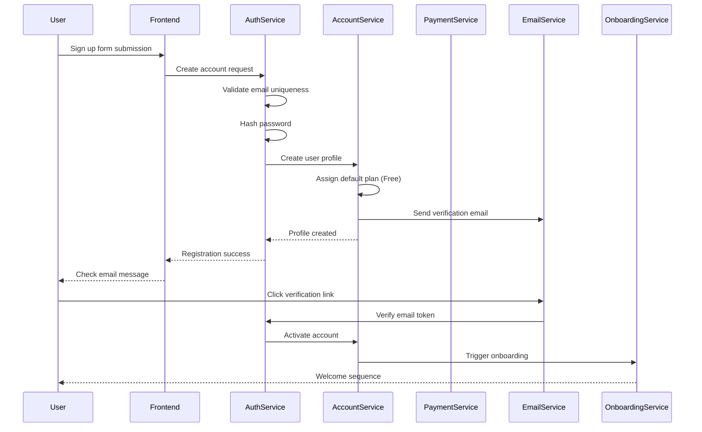
```mermaid
sequenceDiagram
    participant User
    participant Frontend
    participant AuthService
    participant AccountService
    participant PaymentService
    participant EmailService
    participant OnboardingService
    
    User->>Frontend: Sign up form submission
    Frontend->>AuthService: Create account request
    AuthService->>AuthService: Validate email uniqueness
    AuthService->>AuthService: Hash password
    AuthService->>AccountService: Create user profile
    AccountService->>AccountService: Assign default plan (Free)
    AccountService->>EmailService: Send verification email
    AccountService-->>AuthService: Profile created
    AuthService-->>Frontend: Registration success
    Frontend-->>User: Check email message
    
    User->>EmailService: Click verification link
    EmailService->>AuthService: Verify email token
    AuthService->>AccountService: Activate account
    AccountService->>OnboardingService: Trigger onboarding
    OnboardingService-->>User: Welcome sequence
```

### 2.2 Enterprise Account Setup Flow
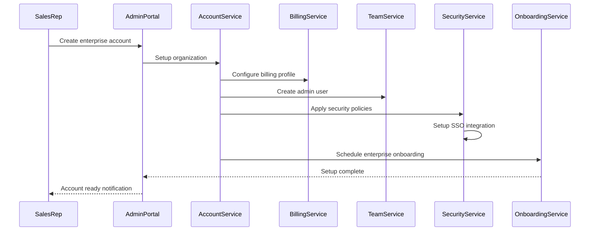
```mermaid
sequenceDiagram
    participant SalesRep
    participant AdminPortal
    participant AccountService
    participant BillingService
    participant TeamService
    participant SecurityService
    participant OnboardingService
    
    SalesRep->>AdminPortal: Create enterprise account
    AdminPortal->>AccountService: Setup organization
    AccountService->>BillingService: Configure billing profile
    AccountService->>TeamService: Create admin user
    AccountService->>SecurityService: Apply security policies
    SecurityService->>SecurityService: Setup SSO integration
    AccountService->>OnboardingService: Schedule enterprise onboarding
    OnboardingService-->>AdminPortal: Setup complete
    AdminPortal-->>SalesRep: Account ready notification
```

## 3. User Profile Management

### 3.1 Profile Update Flow
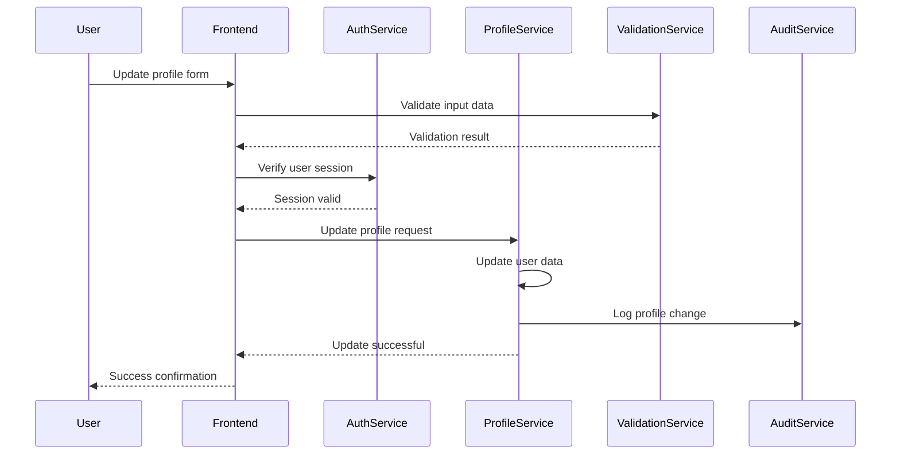
```mermaid
sequenceDiagram
    participant User
    participant Frontend
    participant AuthService
    participant ProfileService
    participant ValidationService
    participant AuditService
    
    User->>Frontend: Update profile form
    Frontend->>ValidationService: Validate input data
    ValidationService-->>Frontend: Validation result
    Frontend->>AuthService: Verify user session
    AuthService-->>Frontend: Session valid
    Frontend->>ProfileService: Update profile request
    ProfileService->>ProfileService: Update user data
    ProfileService->>AuditService: Log profile change
    ProfileService-->>Frontend: Update successful
    Frontend-->>User: Success confirmation
```

### 3.2 Password Change Flow
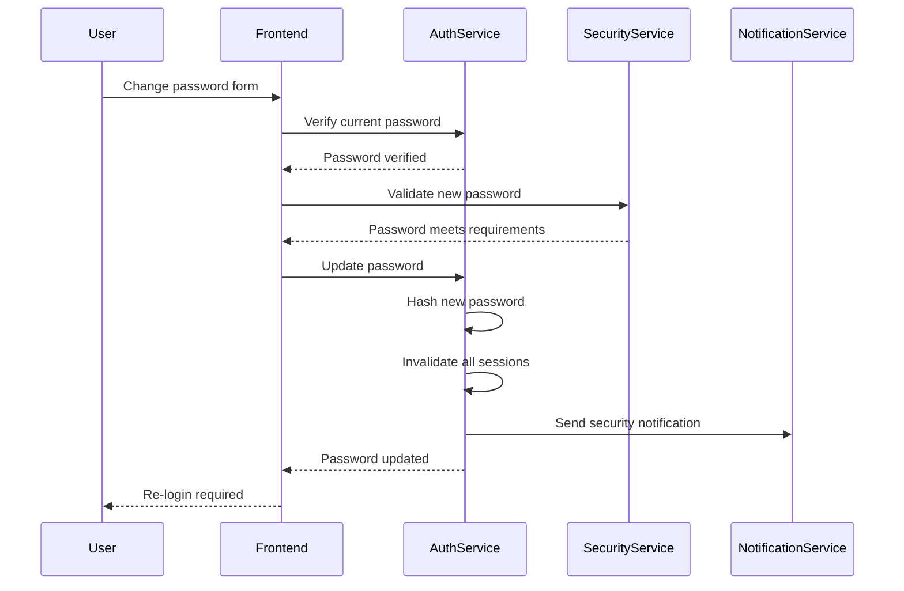
```mermaid
sequenceDiagram
    participant User
    participant Frontend
    participant AuthService
    participant SecurityService
    participant NotificationService
    
    User->>Frontend: Change password form
    Frontend->>AuthService: Verify current password
    AuthService-->>Frontend: Password verified
    Frontend->>SecurityService: Validate new password
    SecurityService-->>Frontend: Password meets requirements
    Frontend->>AuthService: Update password
    AuthService->>AuthService: Hash new password
    AuthService->>AuthService: Invalidate all sessions
    AuthService->>NotificationService: Send security notification
    AuthService-->>Frontend: Password updated
    Frontend-->>User: Re-login required
```

## 4. Team and Organization Management

### 4.1 Team Member Invitation Flow
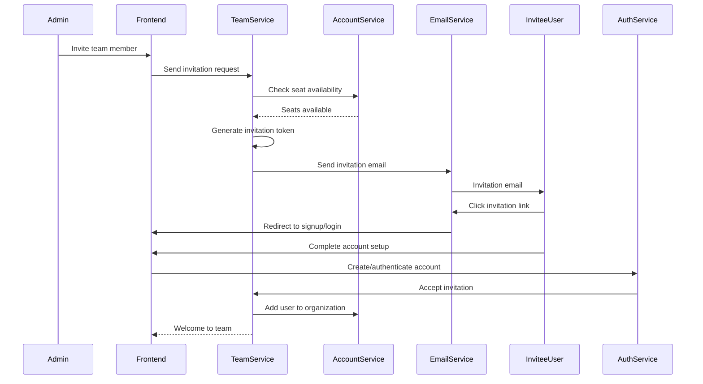
```mermaid
sequenceDiagram
    participant Admin
    participant Frontend
    participant TeamService
    participant AccountService
    participant EmailService
    participant InviteeUser
    participant AuthService
    
    Admin->>Frontend: Invite team member
    Frontend->>TeamService: Send invitation request
    TeamService->>AccountService: Check seat availability
    AccountService-->>TeamService: Seats available
    TeamService->>TeamService: Generate invitation token
    TeamService->>EmailService: Send invitation email
    EmailService->>InviteeUser: Invitation email
    
    InviteeUser->>EmailService: Click invitation link
    EmailService->>Frontend: Redirect to signup/login
    InviteeUser->>Frontend: Complete account setup
    Frontend->>AuthService: Create/authenticate account
    AuthService->>TeamService: Accept invitation
    TeamService->>AccountService: Add user to organization
    TeamService-->>Frontend: Welcome to team
```

### 4.2 Role Assignment Flow
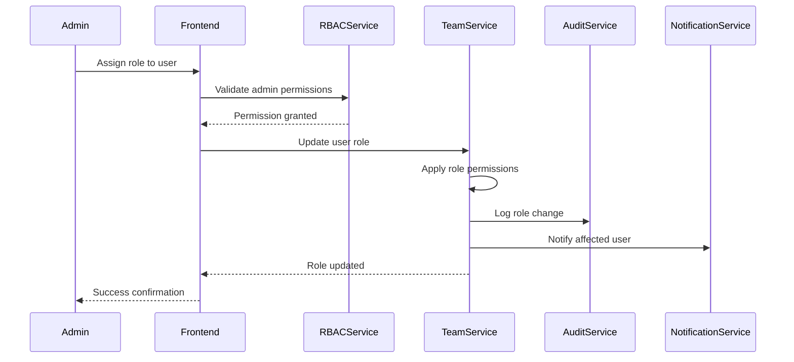
```mermaid
sequenceDiagram
    participant Admin
    participant Frontend
    participant RBACService
    participant TeamService
    participant AuditService
    participant NotificationService
    
    Admin->>Frontend: Assign role to user
    Frontend->>RBACService: Validate admin permissions
    RBACService-->>Frontend: Permission granted
    Frontend->>TeamService: Update user role
    TeamService->>TeamService: Apply role permissions
    TeamService->>AuditService: Log role change
    TeamService->>NotificationService: Notify affected user
    TeamService-->>Frontend: Role updated
    Frontend-->>Admin: Success confirmation
```

### 4.3 Team Member Removal Flow
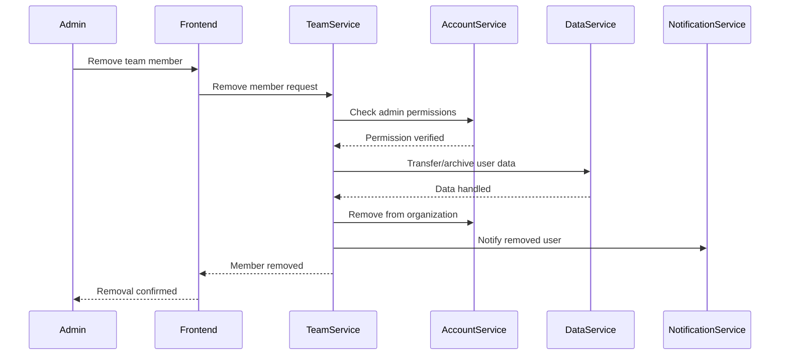
```mermaid
sequenceDiagram
    participant Admin
    participant Frontend
    participant TeamService
    participant AccountService
    participant DataService
    participant NotificationService
    
    Admin->>Frontend: Remove team member
    Frontend->>TeamService: Remove member request
    TeamService->>AccountService: Check admin permissions
    AccountService-->>TeamService: Permission verified
    TeamService->>DataService: Transfer/archive user data
    DataService-->>TeamService: Data handled
    TeamService->>AccountService: Remove from organization
    TeamService->>NotificationService: Notify removed user
    TeamService-->>Frontend: Member removed
    Frontend-->>Admin: Removal confirmed
```

## 5. Access Control and Permissions

### 5.1 Permission Verification Flow
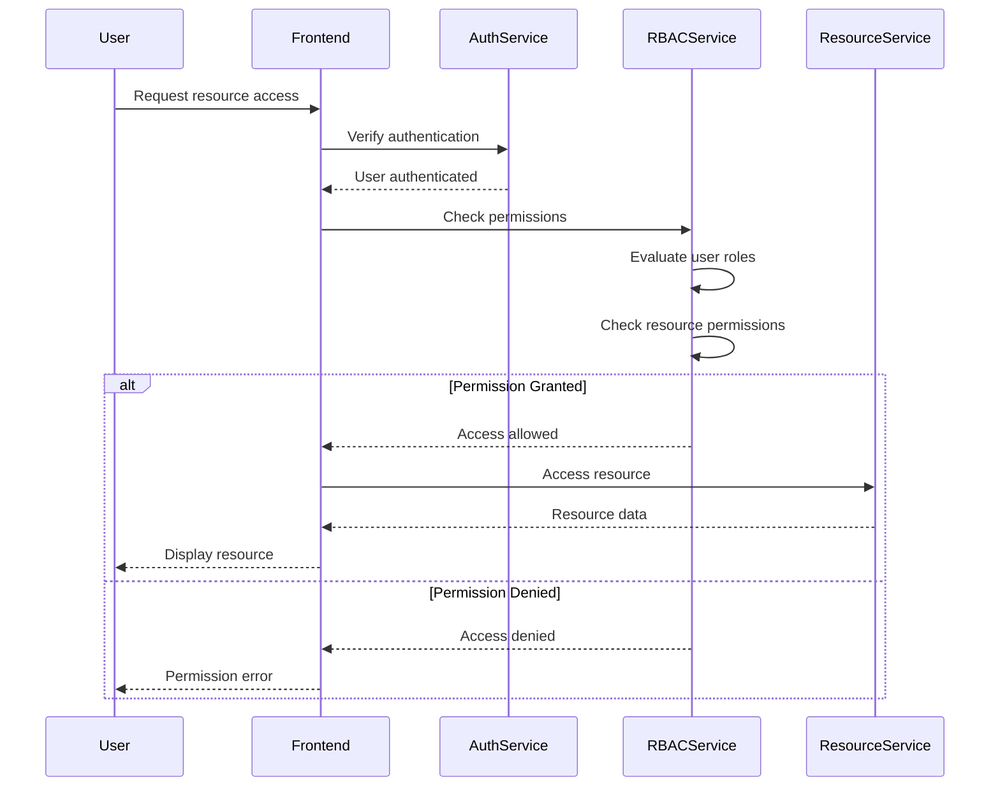
```mermaid
sequenceDiagram
    participant User
    participant Frontend
    participant AuthService
    participant RBACService
    participant ResourceService
    
    User->>Frontend: Request resource access
    Frontend->>AuthService: Verify authentication
    AuthService-->>Frontend: User authenticated
    Frontend->>RBACService: Check permissions
    RBACService->>RBACService: Evaluate user roles
    RBACService->>RBACService: Check resource permissions
    
    alt Permission Granted
        RBACService-->>Frontend: Access allowed
        Frontend->>ResourceService: Access resource
        ResourceService-->>Frontend: Resource data
        Frontend-->>User: Display resource
    else Permission Denied
        RBACService-->>Frontend: Access denied
        Frontend-->>User: Permission error
    end
```

### 5.2 Dynamic Permission Update Flow
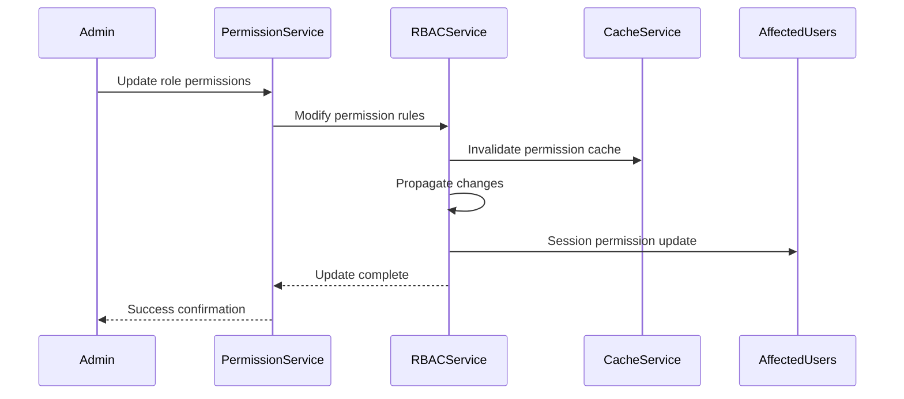
```mermaid
sequenceDiagram
    participant Admin
    participant PermissionService
    participant RBACService
    participant CacheService
    participant AffectedUsers
    
    Admin->>PermissionService: Update role permissions
    PermissionService->>RBACService: Modify permission rules
    RBACService->>CacheService: Invalidate permission cache
    RBACService->>RBACService: Propagate changes
    RBACService->>AffectedUsers: Session permission update
    RBACService-->>PermissionService: Update complete
    PermissionService-->>Admin: Success confirmation
```

## 6. Account Security Management

### 6.1 Multi-Factor Authentication Setup Flow
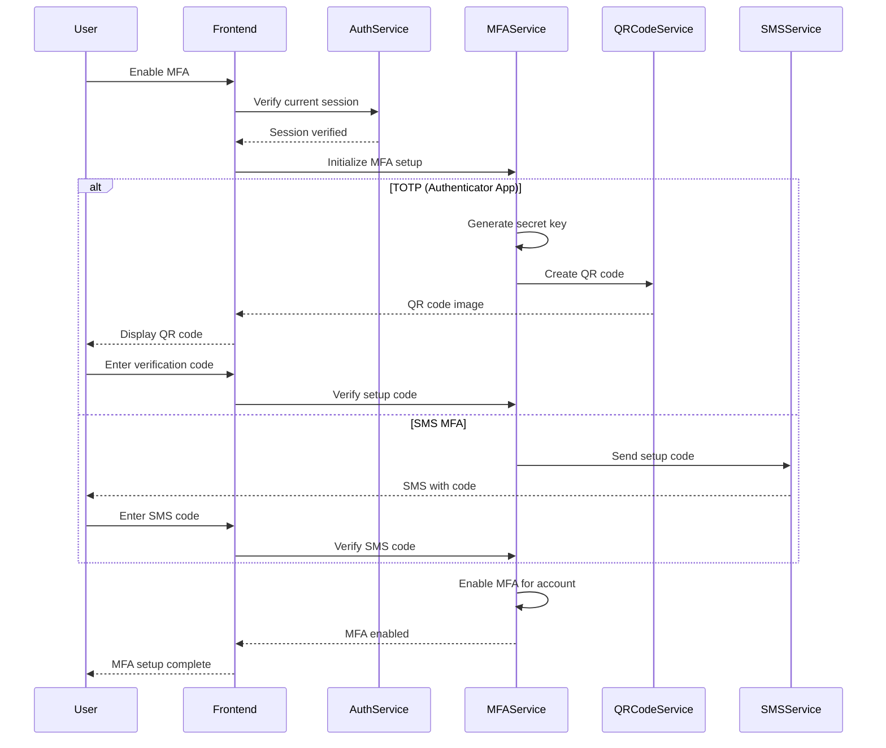
```mermaid
sequenceDiagram
    participant User
    participant Frontend
    participant AuthService
    participant MFAService
    participant QRCodeService
    participant SMSService
    
    User->>Frontend: Enable MFA
    Frontend->>AuthService: Verify current session
    AuthService-->>Frontend: Session verified
    Frontend->>MFAService: Initialize MFA setup
    
    alt TOTP (Authenticator App)
        MFAService->>MFAService: Generate secret key
        MFAService->>QRCodeService: Create QR code
        QRCodeService-->>Frontend: QR code image
        Frontend-->>User: Display QR code
        User->>Frontend: Enter verification code
        Frontend->>MFAService: Verify setup code
    else SMS MFA
        MFAService->>SMSService: Send setup code
        SMSService-->>User: SMS with code
        User->>Frontend: Enter SMS code
        Frontend->>MFAService: Verify SMS code
    end
    
    MFAService->>MFAService: Enable MFA for account
    MFAService-->>Frontend: MFA enabled
    Frontend-->>User: MFA setup complete
```

### 6.2 Account Recovery Flow
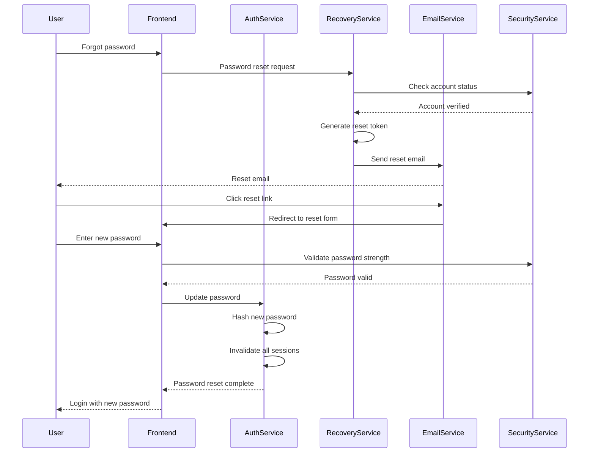
```mermaid
sequenceDiagram
    participant User
    participant Frontend
    participant AuthService
    participant RecoveryService
    participant EmailService
    participant SecurityService
    
    User->>Frontend: Forgot password
    Frontend->>RecoveryService: Password reset request
    RecoveryService->>SecurityService: Check account status
    SecurityService-->>RecoveryService: Account verified
    RecoveryService->>RecoveryService: Generate reset token
    RecoveryService->>EmailService: Send reset email
    EmailService-->>User: Reset email
    
    User->>EmailService: Click reset link
    EmailService->>Frontend: Redirect to reset form
    User->>Frontend: Enter new password
    Frontend->>SecurityService: Validate password strength
    SecurityService-->>Frontend: Password valid
    Frontend->>AuthService: Update password
    AuthService->>AuthService: Hash new password
    AuthService->>AuthService: Invalidate all sessions
    AuthService-->>Frontend: Password reset complete
    Frontend-->>User: Login with new password
```

## 7. Account Settings and Preferences

### 7.1 Notification Preferences Flow
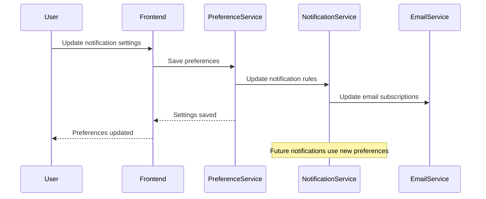
```mermaid
sequenceDiagram
    participant User
    participant Frontend
    participant PreferenceService
    participant NotificationService
    participant EmailService
    
    User->>Frontend: Update notification settings
    Frontend->>PreferenceService: Save preferences
    PreferenceService->>NotificationService: Update notification rules
    NotificationService->>EmailService: Update email subscriptions
    PreferenceService-->>Frontend: Settings saved
    Frontend-->>User: Preferences updated
    
    Note over NotificationService: Future notifications use new preferences
```

### 7.2 API Key Management Flow
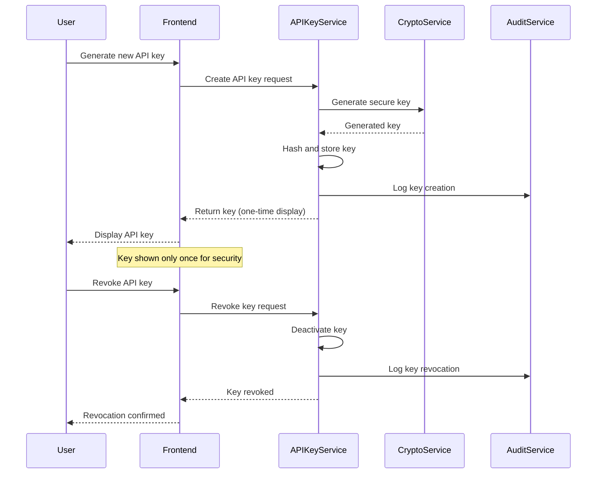
```mermaid
sequenceDiagram
    participant User
    participant Frontend
    participant APIKeyService
    participant CryptoService
    participant AuditService
    
    User->>Frontend: Generate new API key
    Frontend->>APIKeyService: Create API key request
    APIKeyService->>CryptoService: Generate secure key
    CryptoService-->>APIKeyService: Generated key
    APIKeyService->>APIKeyService: Hash and store key
    APIKeyService->>AuditService: Log key creation
    APIKeyService-->>Frontend: Return key (one-time display)
    Frontend-->>User: Display API key
    
    Note over Frontend: Key shown only once for security
    
    User->>Frontend: Revoke API key
    Frontend->>APIKeyService: Revoke key request
    APIKeyService->>APIKeyService: Deactivate key
    APIKeyService->>AuditService: Log key revocation
    APIKeyService-->>Frontend: Key revoked
    Frontend-->>User: Revocation confirmed
```

## 8. Data Management and Privacy

### 8.1 Data Export Flow
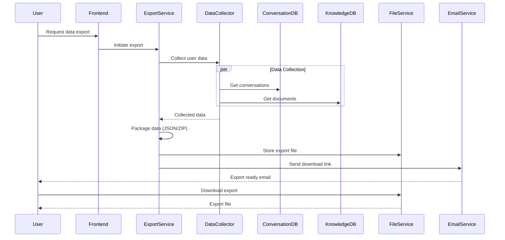
```mermaid
sequenceDiagram
    participant User
    participant Frontend
    participant ExportService
    participant DataCollector
    participant ConversationDB
    participant KnowledgeDB
    participant FileService
    participant EmailService
    
    User->>Frontend: Request data export
    Frontend->>ExportService: Initiate export
    ExportService->>DataCollector: Collect user data
    
    par Data Collection
        DataCollector->>ConversationDB: Get conversations
        DataCollector->>KnowledgeDB: Get documents
    end
    
    DataCollector-->>ExportService: Collected data
    ExportService->>ExportService: Package data (JSON/ZIP)
    ExportService->>FileService: Store export file
    ExportService->>EmailService: Send download link
    EmailService-->>User: Export ready email
    
    User->>FileService: Download export
    FileService-->>User: Export file
```

### 8.2 Account Deletion Flow
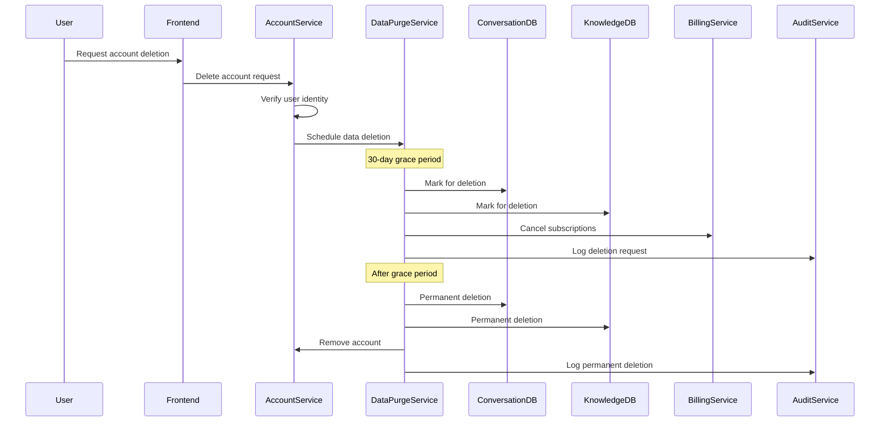
```mermaid
sequenceDiagram
    participant User
    participant Frontend
    participant AccountService
    participant DataPurgeService
    participant ConversationDB
    participant KnowledgeDB
    participant BillingService
    participant AuditService
    
    User->>Frontend: Request account deletion
    Frontend->>AccountService: Delete account request
    AccountService->>AccountService: Verify user identity
    AccountService->>DataPurgeService: Schedule data deletion
    
    Note over DataPurgeService: 30-day grace period
    
    DataPurgeService->>ConversationDB: Mark for deletion
    DataPurgeService->>KnowledgeDB: Mark for deletion
    DataPurgeService->>BillingService: Cancel subscriptions
    DataPurgeService->>AuditService: Log deletion request
    
    Note over DataPurgeService: After grace period
    
    DataPurgeService->>ConversationDB: Permanent deletion
    DataPurgeService->>KnowledgeDB: Permanent deletion
    DataPurgeService->>AccountService: Remove account
    DataPurgeService->>AuditService: Log permanent deletion
```

## 9. Organization and Workspace Management

### 9.1 Workspace Creation Flow
```mermaid
sequenceDiagram
    participant Admin
    participant Frontend
    participant WorkspaceService
    parameter ResourceService
    participant PermissionService
    participant BillingService
    
    Admin->>Frontend: Create new workspace
    Frontend->>WorkspaceService: Workspace creation request
    WorkspaceService->>BillingService: Check workspace limits
    BillingService-->>WorkspaceService: Limit verification
    WorkspaceService->>ResourceService: Allocate resources
    WorkspaceService->>PermissionService: Setup default permissions
    WorkspaceService-->>Frontend: Workspace created
    Frontend-->>Admin: Workspace ready
```

### 9.2 Workspace Sharing Flow
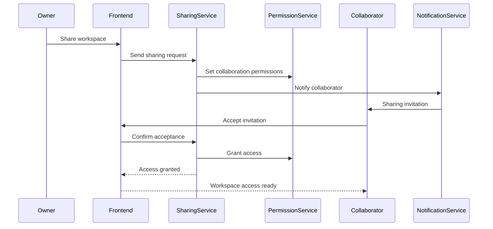
```mermaid
sequenceDiagram
    participant Owner
    participant Frontend
    participant SharingService
    participant PermissionService
    participant Collaborator
    participant NotificationService
    
    Owner->>Frontend: Share workspace
    Frontend->>SharingService: Send sharing request
    SharingService->>PermissionService: Set collaboration permissions
    SharingService->>NotificationService: Notify collaborator
    NotificationService->>Collaborator: Sharing invitation
    
    Collaborator->>Frontend: Accept invitation
    Frontend->>SharingService: Confirm acceptance
    SharingService->>PermissionService: Grant access
    SharingService-->>Frontend: Access granted
    Frontend-->>Collaborator: Workspace access ready
```

## 10. Account Monitoring and Analytics

### 10.1 Usage Tracking Flow
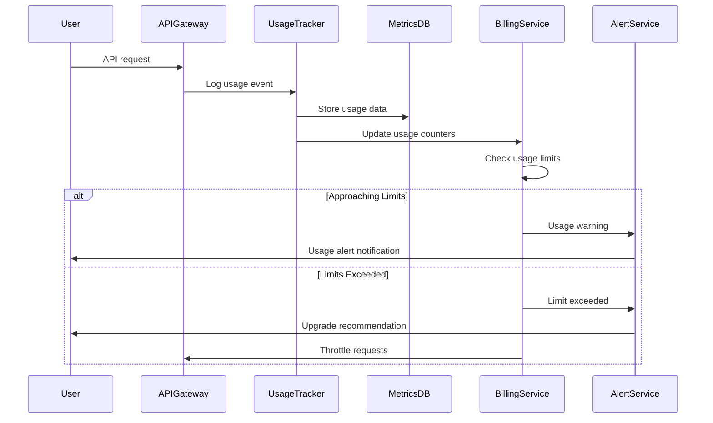
```mermaid
sequenceDiagram
    participant User
    participant APIGateway
    participant UsageTracker
    participant MetricsDB
    participant BillingService
    participant AlertService
    
    User->>APIGateway: API request
    APIGateway->>UsageTracker: Log usage event
    UsageTracker->>MetricsDB: Store usage data
    UsageTracker->>BillingService: Update usage counters
    
    BillingService->>BillingService: Check usage limits
    
    alt Approaching Limits
        BillingService->>AlertService: Usage warning
        AlertService->>User: Usage alert notification
    else Limits Exceeded
        BillingService->>AlertService: Limit exceeded
        AlertService->>User: Upgrade recommendation
        BillingService->>APIGateway: Throttle requests
    end
```

### 10.2 Account Health Monitoring Flow
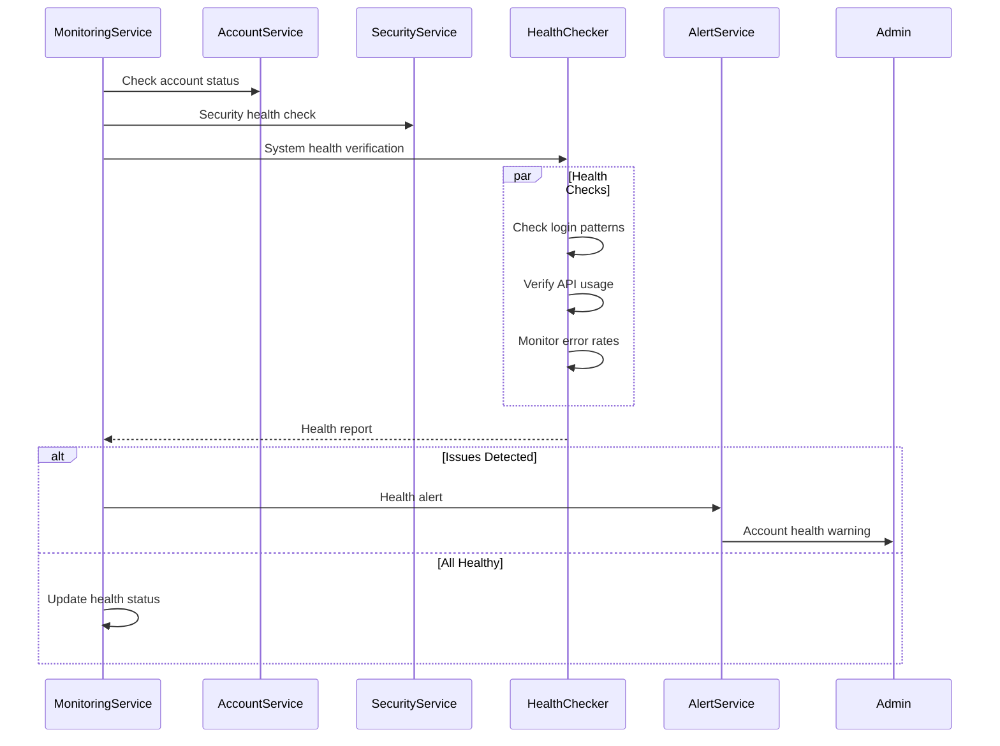
```mermaid
sequenceDiagram
    participant MonitoringService
    participant AccountService
    participant SecurityService
    participant HealthChecker
    participant AlertService
    participant Admin
    
    MonitoringService->>AccountService: Check account status
    MonitoringService->>SecurityService: Security health check
    MonitoringService->>HealthChecker: System health verification
    
    par Health Checks
        HealthChecker->>HealthChecker: Check login patterns
        HealthChecker->>HealthChecker: Verify API usage
        HealthChecker->>HealthChecker: Monitor error rates
    end
    
    HealthChecker-->>MonitoringService: Health report
    
    alt Issues Detected
        MonitoringService->>AlertService: Health alert
        AlertService->>Admin: Account health warning
    else All Healthy
        MonitoringService->>MonitoringService: Update health status
    end
```

## 11. Compliance and Audit

### 11.1 Audit Trail Flow
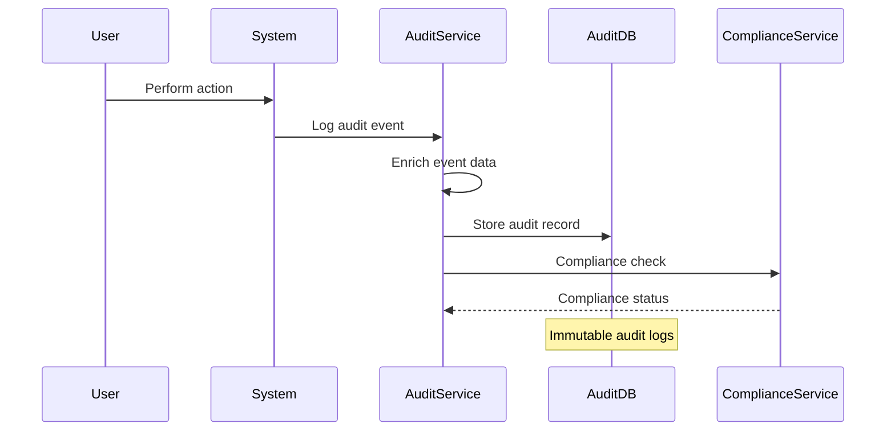
```mermaid
sequenceDiagram
    participant User
    participant System
    participant AuditService
    participant AuditDB
    participant ComplianceService
    
    User->>System: Perform action
    System->>AuditService: Log audit event
    AuditService->>AuditService: Enrich event data
    AuditService->>AuditDB: Store audit record
    AuditService->>ComplianceService: Compliance check
    ComplianceService-->>AuditService: Compliance status
    
    Note over AuditDB: Immutable audit logs
```

### 11.2 Compliance Reporting Flow
```mermaid
sequenceDiagram
    participant ComplianceOfficer
    participant ReportingService
    participant AuditDB
    participant DataProcessor
    participant ReportGenerator
    
    ComplianceOfficer->>ReportingService: Request compliance report
    ReportingService->>AuditDB: Query audit data
    AuditDB-->>ReportingService: Audit records
    ReportingService->>DataProcessor: Process compliance data
    DataProcessor->>ReportGenerator: Generate report
    ReportGenerator-->>ReportingService: Compliance report
    ReportingService-->>ComplianceOfficer: Delivery report
```

## 12. Account Integration and SSO

### 12.1 SSO Configuration Flow
```mermaid
sequenceDiagram
    participant Admin
    participant SSOService
    participant IdentityProvider
    participant ConfigService
    participant TestService
    
    Admin->>SSOService: Configure SSO
    SSOService->>IdentityProvider: Exchange metadata
    IdentityProvider-->>SSOService: SAML/OIDC configuration
    SSOService->>ConfigService: Store SSO settings
    SSOService->>TestService: Test SSO connection
    TestService->>IdentityProvider: Test authentication
    IdentityProvider-->>TestService: Test result
    TestService-->>SSOService: Connection verified
    SSOService-->>Admin: SSO ready
```

### 12.2 SSO Authentication Flow
```mermaid
sequenceDiagram
    participant User
    participant Frontend
    participant SSOService
    participant IdentityProvider
    participant AccountService
    participant SessionService
    
    User->>Frontend: Login with SSO
    Frontend->>SSOService: Initiate SSO
    SSOService->>IdentityProvider: Redirect for authentication
    User->>IdentityProvider: Enter credentials
    IdentityProvider->>IdentityProvider: Authenticate user
    IdentityProvider->>SSOService: SAML/OIDC response
    SSOService->>AccountService: Create/update user account
    SSOService->>SessionService: Create session
    SessionService-->>Frontend: Session established
    Frontend-->>User: Logged in successfully
```

This comprehensive account management flow documentation provides detailed technical specifications for implementing all aspects of user and organization management within the AI API platform, ensuring secure, scalable, and compliant account operations.
