# API Flows - AI API Platform

## 1. Overview

This document details the complete API flow architecture for the AI API Platform, including request/response patterns, authentication flows, data processing pipelines, and integration patterns for all system components.

## 2. Authentication API Flow

### 2.1 User Authentication Flow


#### Request/Response Examples:

**Login Request:**
```json
POST /auth/login
{
  "email": "user@example.com",
  "password": "securePassword123",
  "mfaCode": "123456" // optional
}
```

**Login Response:**
```json
{
  "success": true,
  "data": {
    "accessToken": "eyJhbGciOiJSUzI1NiIs...",
    "refreshToken": "eyJhbGciOiJSUzI1NiIs...",
    "expiresIn": 3600,
    "tokenType": "Bearer",
    "user": {
      "id": "user-uuid",
      "email": "user@example.com",
      "role": "user",
      "subscription": "pro"
    }
  }
}
```

### 2.2 API Key Authentication Flow


## 3. Conversation API Flow

### 3.1 Send Message Flow


#### Send Message Request:
```json
POST /conversation/send
{
  "sessionId": "conv-uuid",
  "message": "How do I implement authentication?",
  "metadata": {
    "attachments": [],
    "context": {
      "previousContext": true,
      "modelPreference": "gpt-4"
    }
  }
}
```

#### Send Message Response:
```json
{
  "success": true,
  "data": {
    "messageId": "msg-uuid",
    "response": "To implement authentication, you should...",
    "metadata": {
      "model": "gpt-4",
      "processingTime": 1234,
      "tokens": {
        "input": 45,
        "output": 150,
        "total": 195
      },
      "sources": [
        {
          "type": "knowledge_base",
          "id": "doc-uuid",
          "title": "Authentication Guide",
          "relevance": 0.95
        }
      ],
      "scenarios": [
        {
          "id": "scenario-uuid",
          "confidence": 0.87,
          "title": "Authentication Implementation"
        }
      ]
    }
  }
}
```

### 3.2 Streaming Response Flow


## 4. Knowledge Base API Flow

### 4.1 Document Upload Flow


#### Upload Request:
```json
POST /knowledge/upload
Content-Type: multipart/form-data

{
  "file": <binary-data>,
  "metadata": {
    "title": "API Documentation",
    "category": "technical",
    "tags": ["api", "documentation", "reference"],
    "visibility": "team"
  }
}
```

#### Upload Response:
```json
{
  "success": true,
  "data": {
    "documentId": "doc-uuid",
    "filename": "api-docs.pdf",
    "size": 2048576,
    "status": "processing",
    "processingJob": {
      "id": "job-uuid",
      "estimatedDuration": 120,
      "progress": 0
    }
  }
}
```

### 4.2 Knowledge Search Flow


## 5. AI Model Integration Flow

### 5.1 AI Provider Selection Flow


### 5.2 Multi-Provider Request Flow


## 6. Scenario Learning API Flow

### 6.1 Scenario Matching Flow


### 6.2 Scenario Learning Flow


## 7. Analytics and Monitoring API Flow

### 7.1 Real-time Analytics Flow


### 7.2 Custom Report Generation Flow


## 8. Error Handling and Resilience Patterns

### 8.1 Circuit Breaker Pattern


### 8.2 Retry with Exponential Backoff


## 9. Security API Flows

### 9.1 API Security Validation Flow


### 9.2 Data Encryption Flow


## 10. Integration API Patterns

### 10.1 Webhook Event Flow

```mermaid
sequenceDiagram
    participant SystemEvent
    participant EventDispatcher
    participant WebhookService
    participant ClientEndpoint
    participant RetryQueue
    
    SystemEvent->>EventDispatcher: Trigger event
    EventDispatcher->>WebhookService: Process webhook
    WebhookService->>WebhookService: Build payload
    WebhookService->>ClientEndpoint: POST webhook data
    
    alt Successful Delivery
        ClientEndpoint-->>WebhookService: 200 OK
        WebhookService->>WebhookService: Mark delivered
    else Failed Delivery
        ClientEndpoint-->>WebhookService: Error/Timeout
        WebhookService->>RetryQueue: Queue for retry
        
        loop Retry Logic
            RetryQueue->>ClientEndpoint: Retry delivery
            alt Success
                ClientEndpoint-->>RetryQueue: 200 OK
                RetryQueue->>RetryQueue: Mark delivered
            else Still Failing
                RetryQueue->>RetryQueue: Exponential backoff
            end
        end
    end
```


### 10.2 Third-party API Integration Flow


## 11. Performance Optimization Flows

### 11.1 Caching Strategy Flow


### 11.2 Async Processing Flow


This comprehensive API flow documentation provides detailed technical specifications for implementing all system interactions, ensuring robust, scalable, and secure API operations across the entire AI platform.
