# Deployment and Operations - AI API Platform

## 1. Overview

This document outlines the comprehensive deployment and operational procedures for the AI API Platform, including CI/CD pipelines, infrastructure provisioning, monitoring, maintenance, and disaster recovery operations.

## 2. Development and Deployment Pipeline

### 2.1 CI/CD Pipeline Architecture
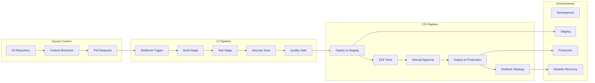

### 2.2 Build and Test Pipeline
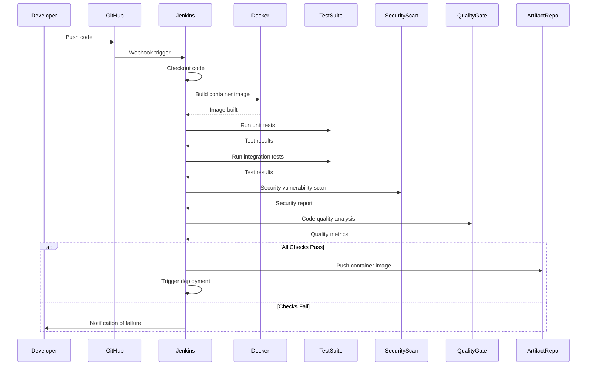

## 3. Infrastructure as Code

### 3.1 Terraform Infrastructure Provisioning
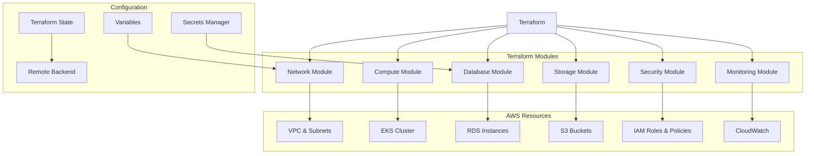

### 3.2 Kubernetes Deployment Configuration
```yaml
# Example Kubernetes Deployment
apiVersion: apps/v1
kind: Deployment
metadata:
  name: ai-api-service
  namespace: production
spec:
  replicas: 3
  selector:
    matchLabels:
      app: ai-api-service
  template:
    metadata:
      labels:
        app: ai-api-service
    spec:
      containers:
      - name: ai-api
        image: ai-api:latest
        ports:
        - containerPort: 8080
        env:
        - name: DATABASE_URL
          valueFrom:
            secretKeyRef:
              name: database-secret
              key: url
        resources:
          requests:
            memory: "512Mi"
            cpu: "250m"
          limits:
            memory: "1Gi"
            cpu: "500m"
        readinessProbe:
          httpGet:
            path: /health
            port: 8080
          initialDelaySeconds: 30
          periodSeconds: 10
        livenessProbe:
          httpGet:
            path: /health
            port: 8080
          initialDelaySeconds: 60
          periodSeconds: 30
```

## 4. Environment Management

### 4.1 Environment Promotion Flow
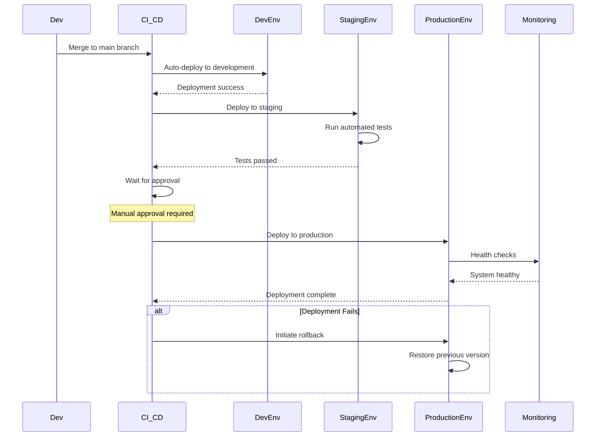

### 4.2 Configuration Management
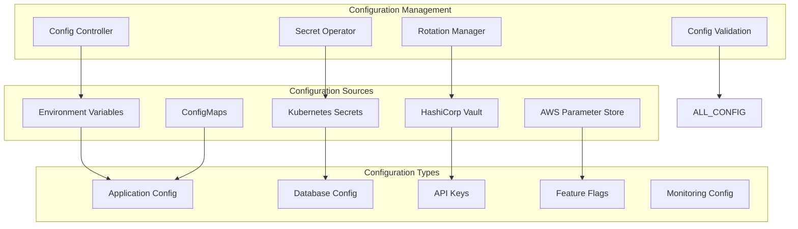

## 5. Deployment Strategies

### 5.1 Blue-Green Deployment
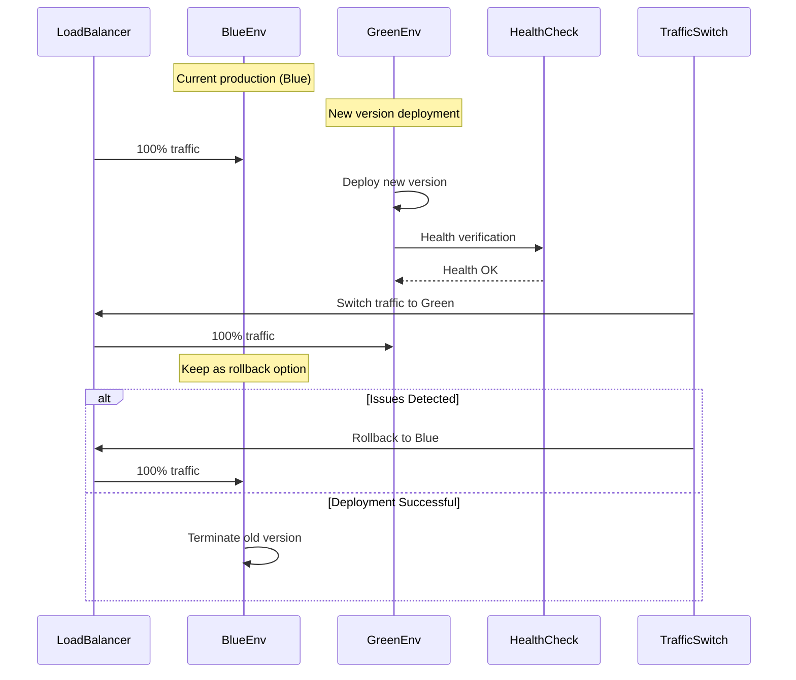

### 5.2 Canary Deployment
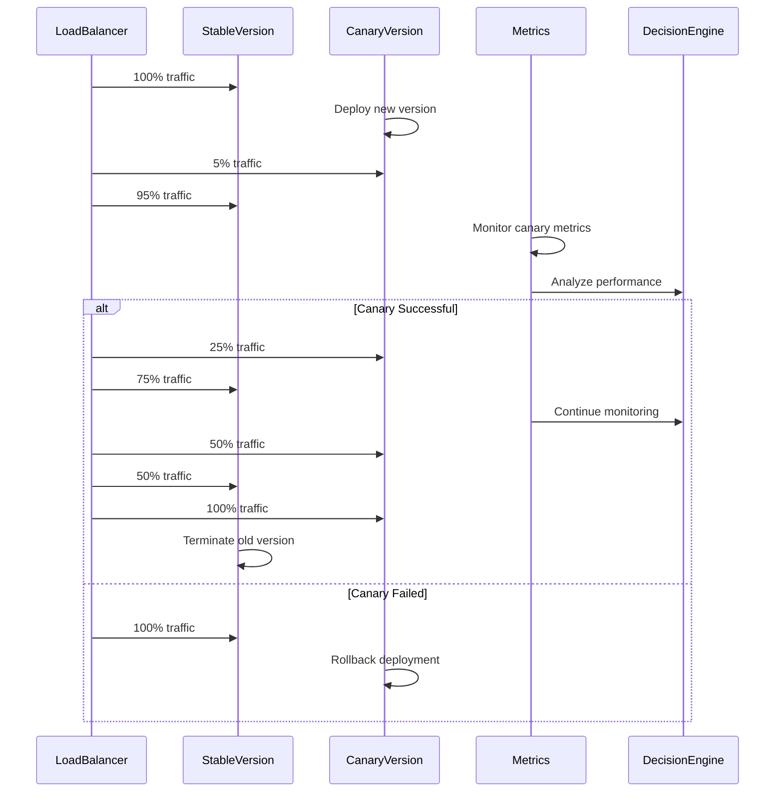

## 6. Monitoring and Alerting Operations

### 6.1 Operational Monitoring Stack
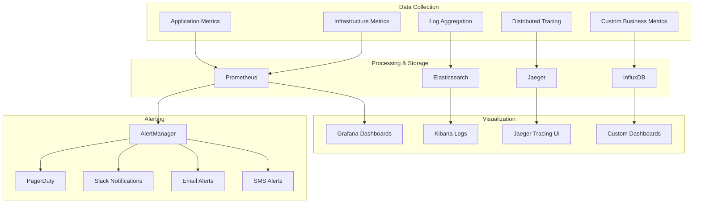

### 6.2 Alert Management Flow
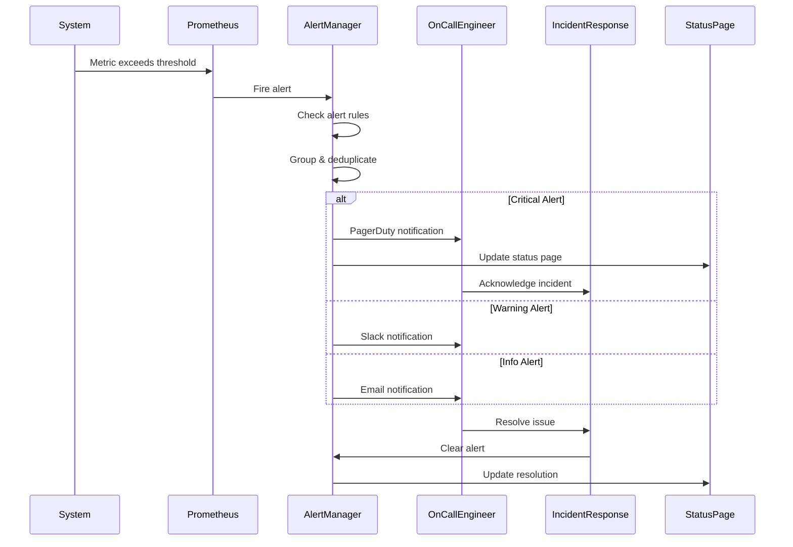

## 7. Backup and Disaster Recovery

### 7.1 Backup Strategy
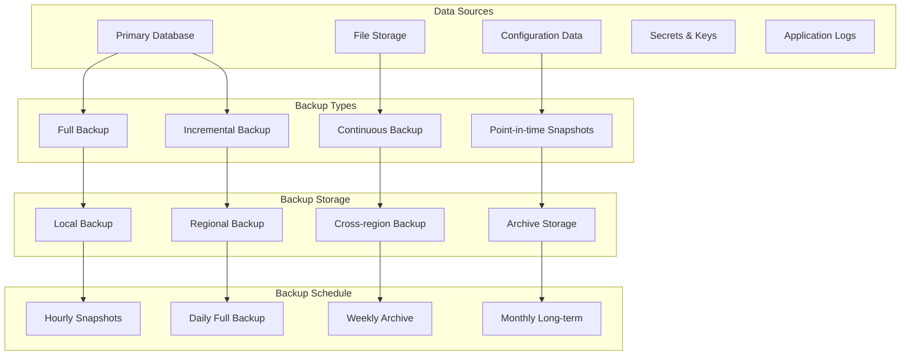

### 7.2 Disaster Recovery Procedures
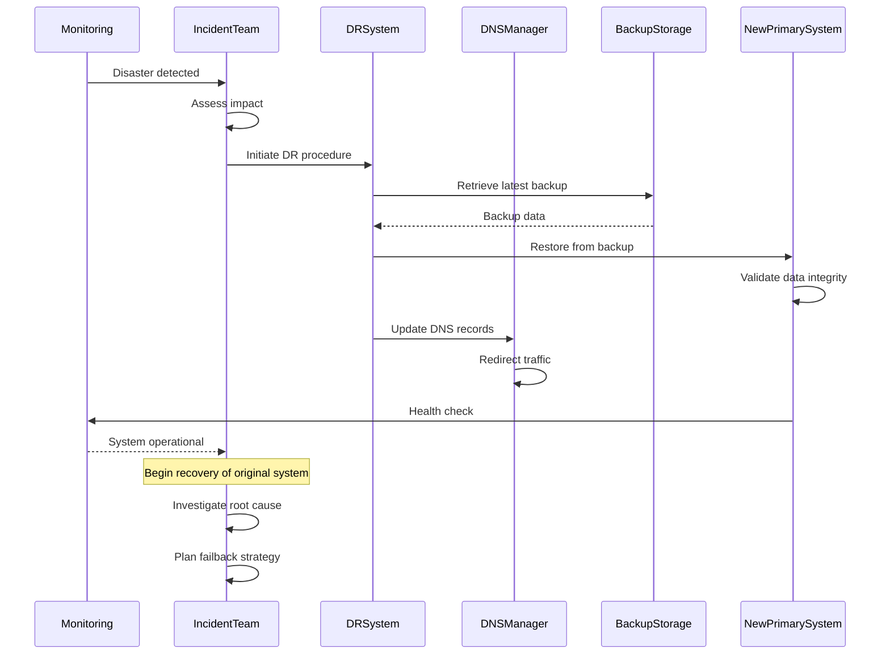

## 8. Security Operations

### 8.1 Security Monitoring and Response
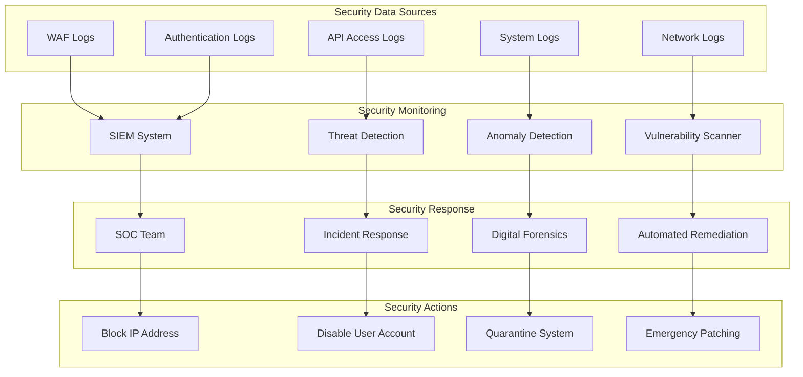

### 8.2 Certificate and Secret Management
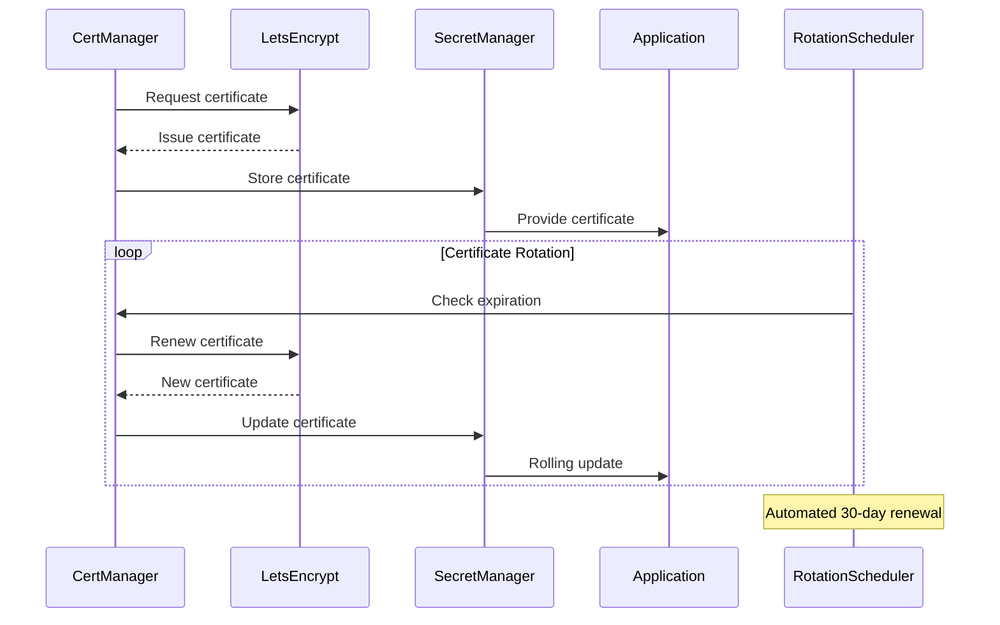

## 9. Performance and Capacity Management

### 9.1 Auto-scaling Operations
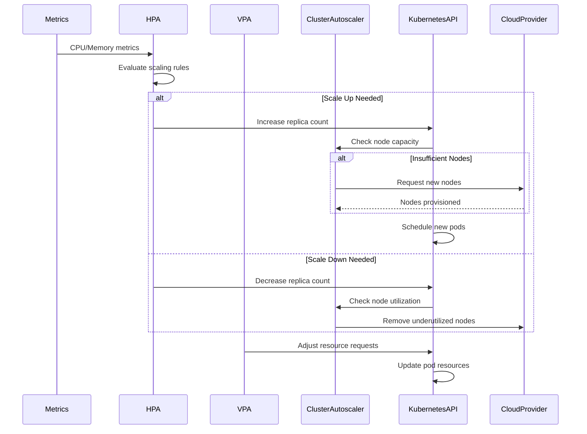

### 9.2 Capacity Planning Process
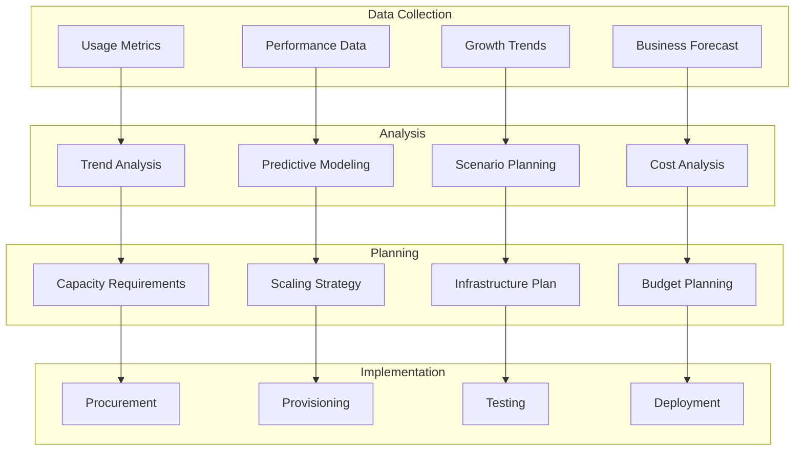

## 10. Maintenance and Updates

### 10.1 Maintenance Window Management
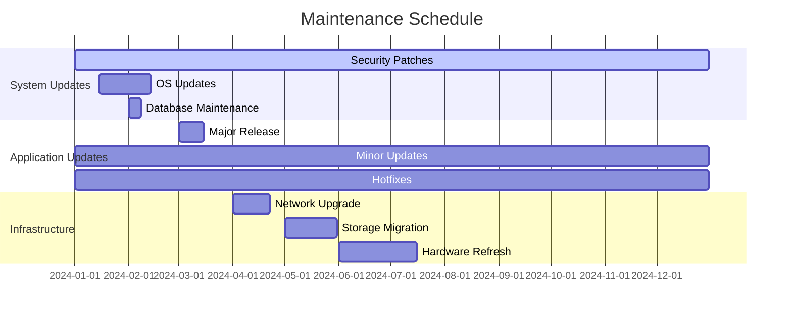

### 10.2 Update Deployment Process
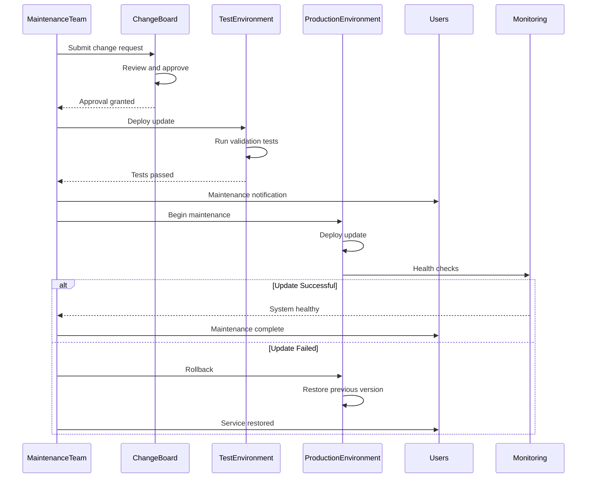

## 11. Operational Runbooks

### 11.1 Incident Response Runbook
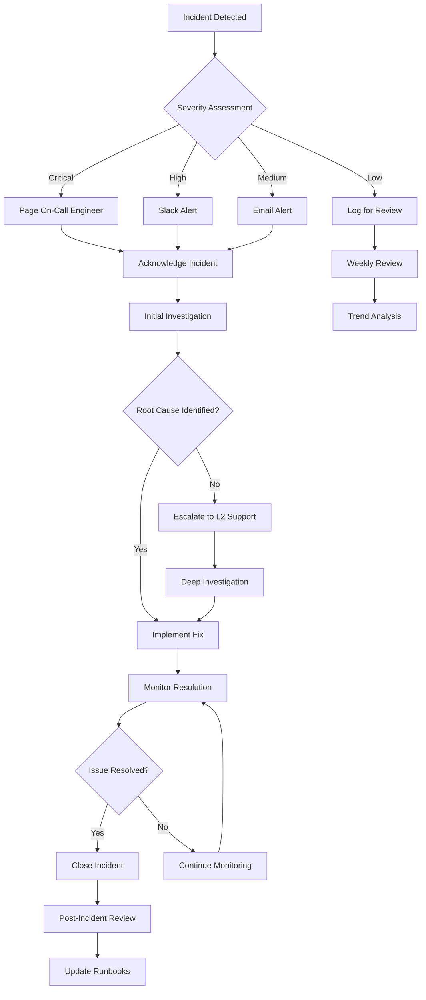

### 11.2 Database Maintenance Runbook
```yaml
# Database Maintenance Checklist
database_maintenance:
  pre_maintenance:
    - name: "Create backup"
      command: "pg_dump -h $DB_HOST -U $DB_USER $DB_NAME > backup_$(date +%Y%m%d).sql"
    - name: "Verify backup integrity"
      command: "pg_restore --list backup_$(date +%Y%m%d).sql"
    - name: "Check replication lag"
      command: "SELECT pg_last_wal_receive_lsn(), pg_last_wal_replay_lsn();"
    - name: "Enable maintenance mode"
      command: "kubectl patch deployment api-service -p '{\"spec\":{\"replicas\":0}}'"
  
  maintenance_tasks:
    - name: "Update statistics"
      command: "ANALYZE;"
    - name: "Reindex tables"
      command: "REINDEX DATABASE $DB_NAME;"
    - name: "Vacuum full"
      command: "VACUUM FULL;"
    - name: "Update extensions"
      command: "ALTER EXTENSION vector UPDATE;"
  
  post_maintenance:
    - name: "Disable maintenance mode"
      command: "kubectl patch deployment api-service -p '{\"spec\":{\"replicas\":3}}'"
    - name: "Health check"
      command: "curl -f http://api-service/health"
    - name: "Monitor performance"
      command: "Check Grafana dashboard"
    - name: "Update maintenance log"
      command: "Log completion in maintenance system"
```

This comprehensive deployment and operations documentation provides detailed procedures for managing the entire lifecycle of the AI API platform, ensuring reliable, secure, and scalable operations in production environments.
