# SAAS Payment and Pricing Management - AI API Platform

## 1. Overview

This document outlines the comprehensive SAAS payment and pricing management system for the AI API Platform, including subscription models, billing cycles, payment processing, usage tracking, and revenue optimization strategies.

## 2. Pricing Strategy and Tiers

### 2.1 Subscription Tiers
```mermaid
graph TD
    A[Pricing Tiers] --> B[Free Tier]
    A --> C[Starter Plan]
    A --> D[Professional Plan]
    A --> E[Enterprise Plan]
    A --> F[Custom Enterprise]
    
    B --> B1[1,000 messages/month]
    B --> B2[Basic AI models]
    B --> B3[5MB knowledge base]
    B --> B4[Email support]
    
    C --> C1[10,000 messages/month]
    C --> C2[All AI models]
    C --> C3[100MB knowledge base]
    C --> C4[Chat support]
    C --> C5[$29/month]
    
    D --> D1[100,000 messages/month]
    D --> D2[Priority AI access]
    D --> D3[1GB knowledge base]
    D --> D4[Advanced analytics]
    D --> D5[Team collaboration]
    D --> D6[$99/month]
    
    E --> E1[Unlimited messages]
    E --> E2[Custom AI models]
    E --> E3[Unlimited knowledge base]
    E --> E4[SSO integration]
    E --> E5[Priority support]
    E --> E6[$299/month]
    
    F --> F1[Custom limits]
    F --> F2[On-premise deployment]
    F --> F3[Custom integrations]
    F --> F4[Dedicated support]
    F --> F5[Custom pricing]
```

### 2.2 Usage-Based Pricing Components
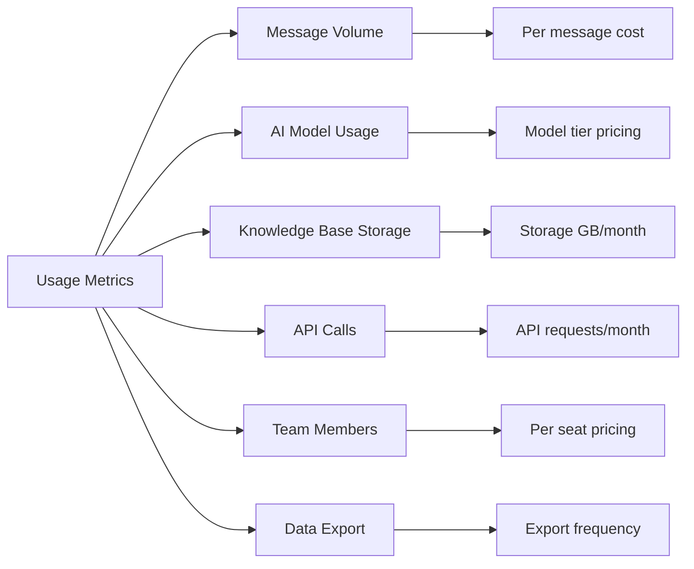

## 3. Subscription Management Flow

### 3.1 Plan Selection and Subscription Flow
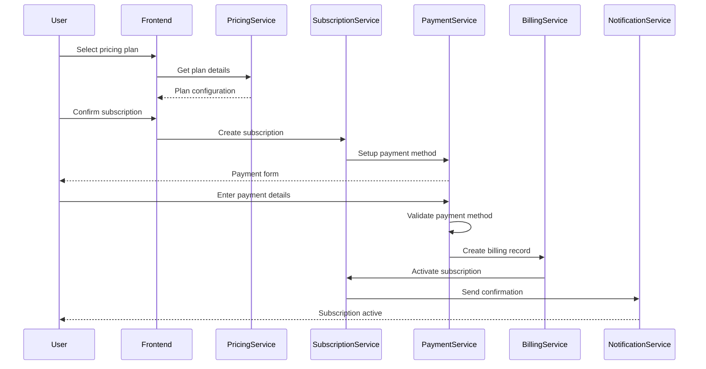

### 3.2 Plan Upgrade/Downgrade Flow
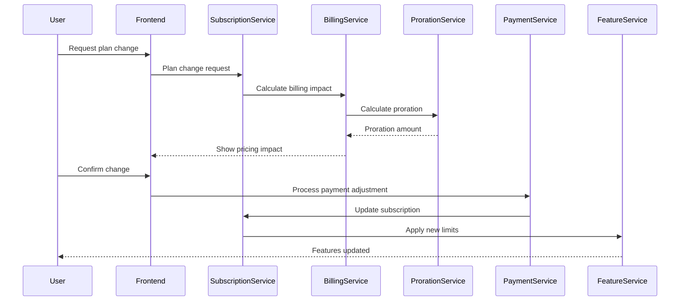

## 4. Payment Processing Architecture

### 4.1 Payment Gateway Integration Flow
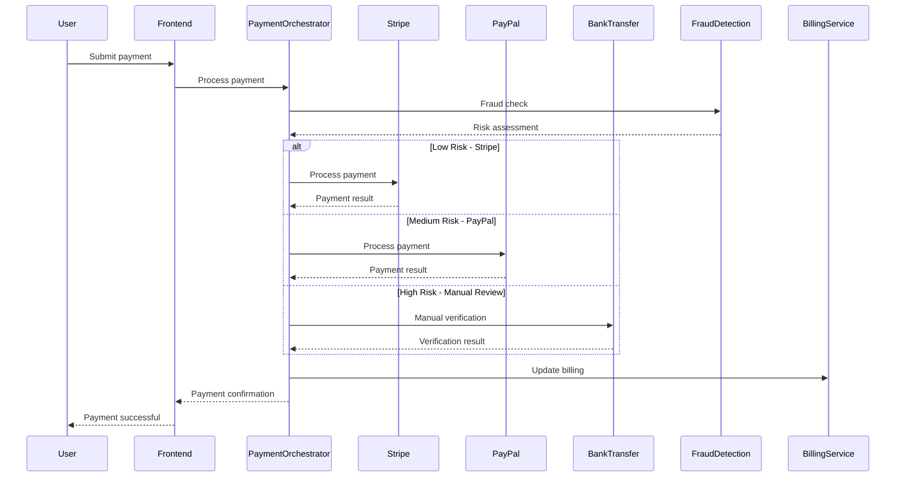

### 4.2 Recurring Billing Flow
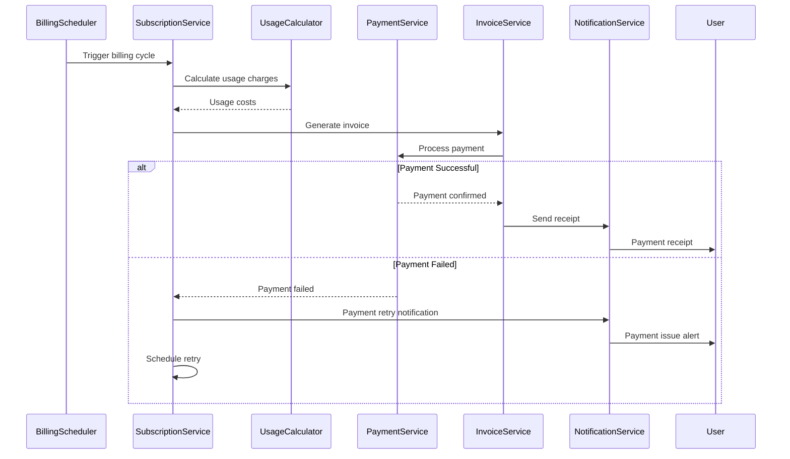

## 5. Usage Tracking and Metering

### 5.1 Real-time Usage Tracking Flow
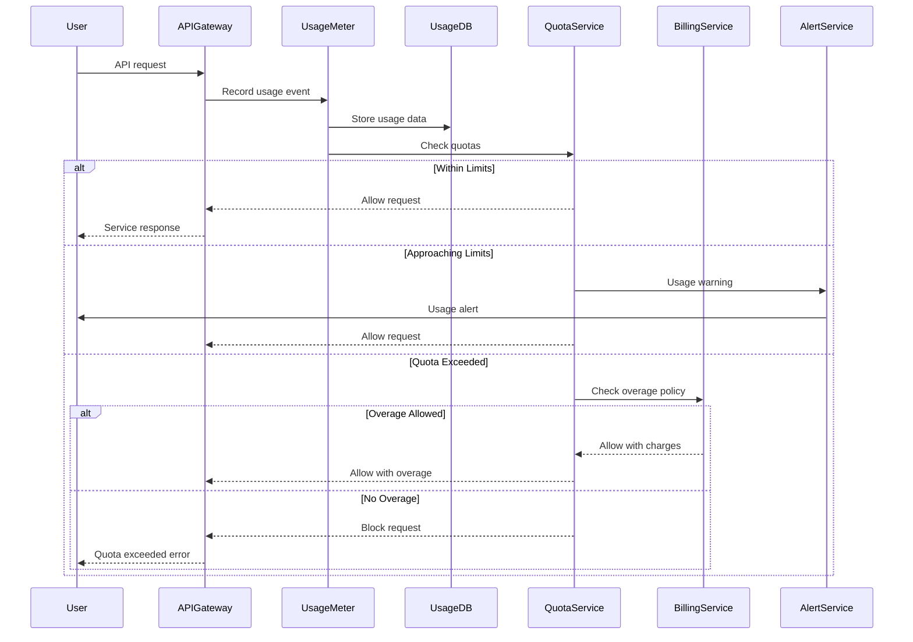

### 5.2 Usage Aggregation and Reporting Flow
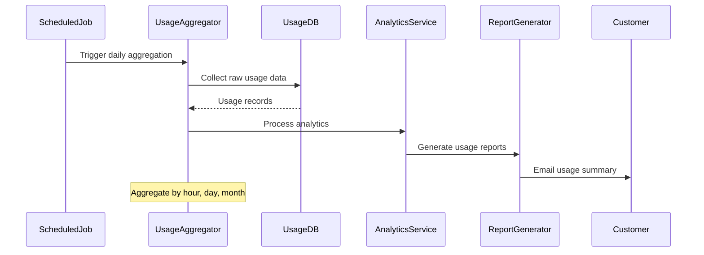

## 6. Invoice and Billing Management

### 6.1 Invoice Generation Flow
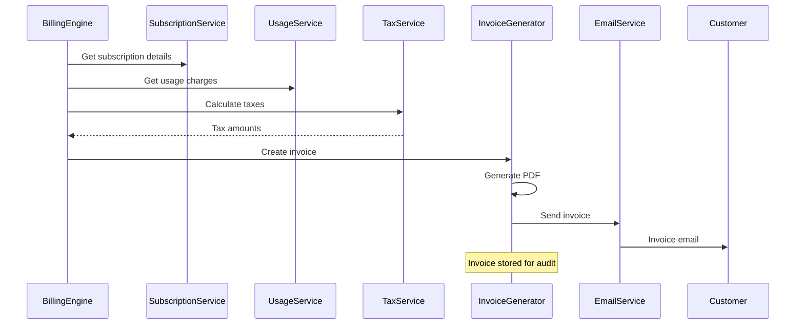

### 6.2 Payment Reconciliation Flow
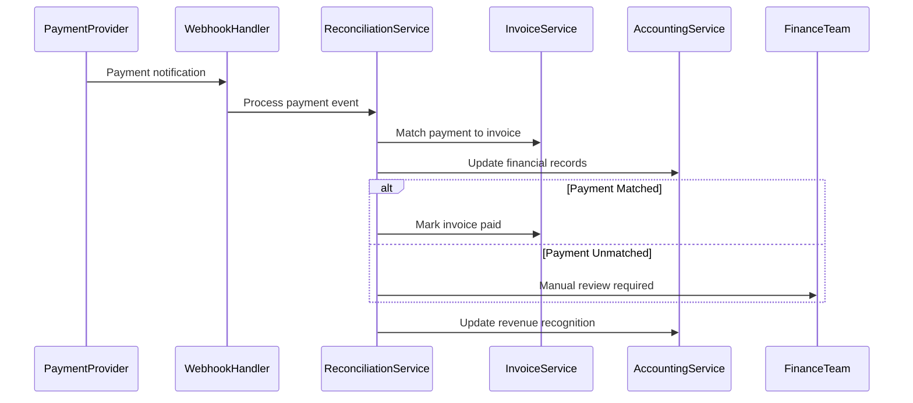

## 7. Revenue Management and Optimization

### 7.1 Revenue Recognition Flow
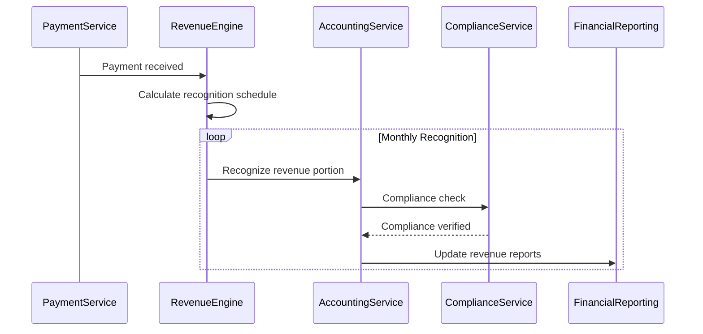

### 7.2 Pricing Optimization Flow
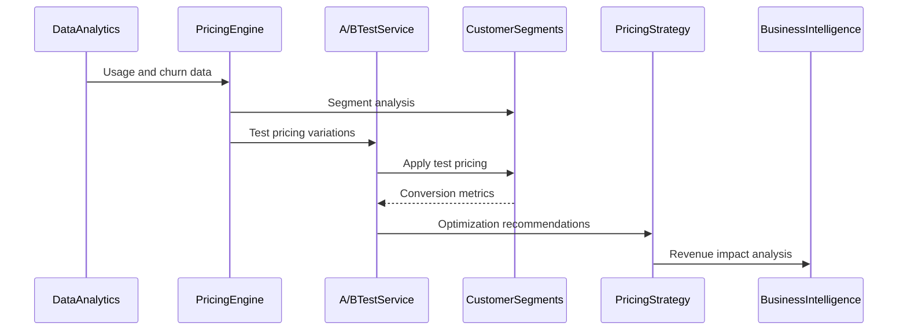

## 8. Customer Lifecycle and Retention

### 8.1 Churn Prediction and Prevention Flow
```mermaid
sequenceDiagram
    participant MLModel
    participant CustomerData
    parameter ChurnPredictor
    participant RetentionEngine
    participant CampaignService
    participant Customer
    
    MLModel->>CustomerData: Analyze usage patterns
    CustomerData-->>ChurnPredictor: Customer metrics
    ChurnPredictor->>ChurnPredictor: Calculate churn risk
    
    alt High Churn Risk
        ChurnPredictor->>RetentionEngine: Trigger retention campaign
        RetentionEngine->>CampaignService: Launch intervention
        CampaignService->>Customer: Personalized offer
    else Medium Risk
        ChurnPredictor->>RetentionEngine: Schedule check-in
        RetentionEngine->>Customer: Proactive support
    else Low Risk
        ChurnPredictor->>RetentionEngine: Continue monitoring
    end
```

### 8.2 Upgrade Recommendation Flow
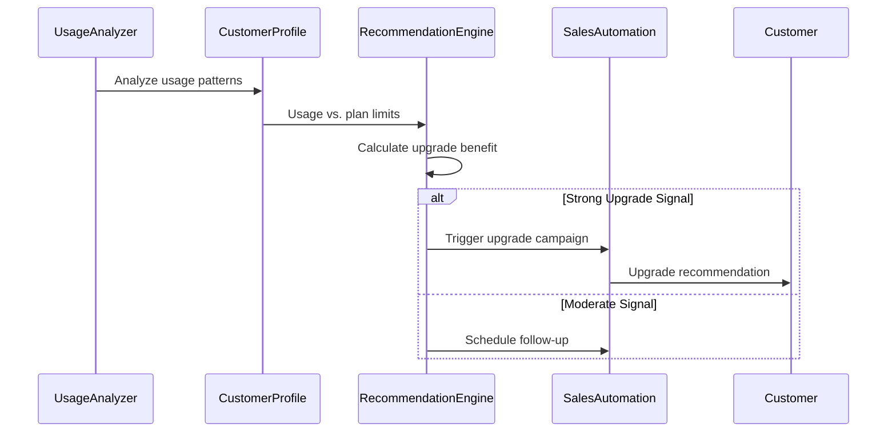

## 9. Financial Reporting and Analytics

### 9.1 Financial Dashboard Flow
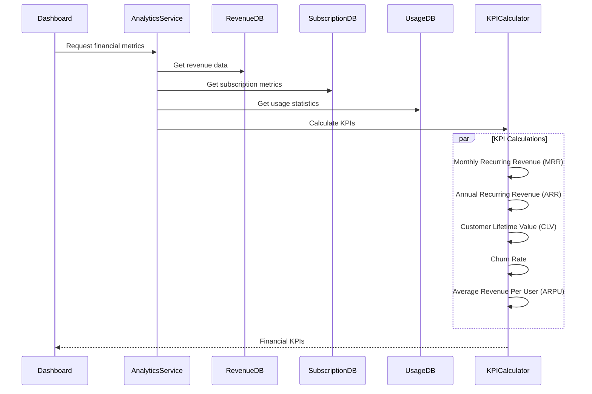

### 9.2 Revenue Forecasting Flow
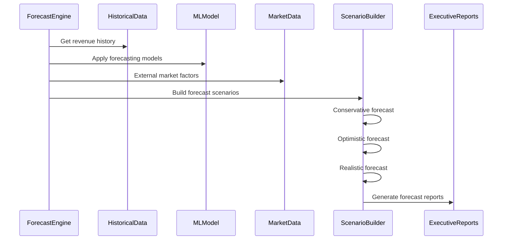

## 10. Compliance and Tax Management

### 10.1 Tax Calculation Flow
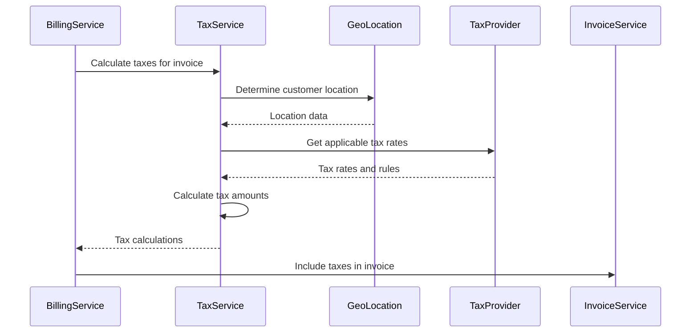

### 10.2 Revenue Compliance Flow
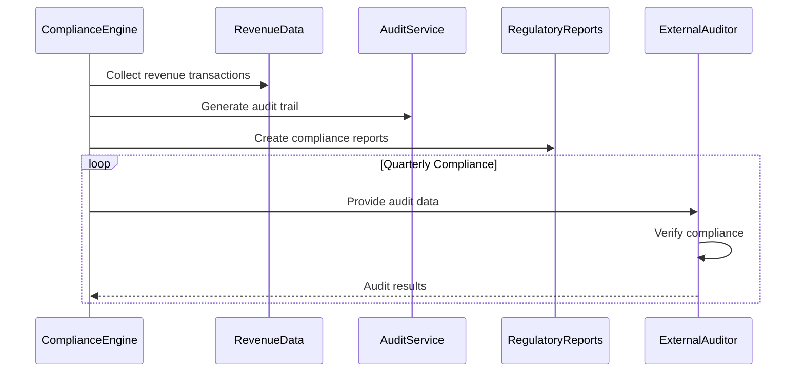

## 11. Payment Security and Fraud Prevention

### 11.1 Fraud Detection Flow
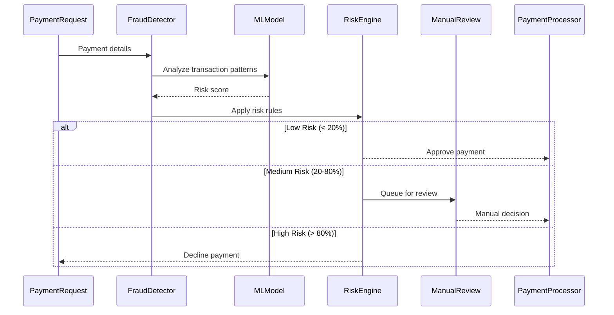

### 11.2 PCI Compliance Flow
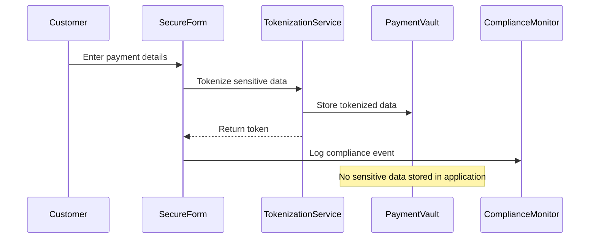

## 12. Advanced SAAS Features

### 12.1 Multi-Currency Support Flow
```mermaid
sequenceDiagram
    participant Customer
    participant CurrencyService
    participant ExchangeRateAPI
    participant BillingService
    participant PaymentProcessor
    
    Customer->>CurrencyService: Select preferred currency
    CurrencyService->>ExchangeRateAPI: Get current rates
    ExchangeRateAPI-->>CurrencyService: Exchange rates
    CurrencyService->>BillingService: Convert pricing
    BillingService->>PaymentProcessor: Process in customer currency
    PaymentProcessor-->>Customer: Charge in preferred currency
```

### 12.2 Enterprise Contract Management Flow
```mermaid
sequenceDiagram
    participant SalesTeam
    participant ContractService
    participant LegalReview
    participant CustomPricing
    participant ProvisioningService
    participant Customer
    
    SalesTeam->>ContractService: Create enterprise contract
    ContractService->>LegalReview: Legal approval process
    LegalReview-->>ContractService: Approved contract
    ContractService->>CustomPricing: Configure custom pricing
    CustomPricing->>ProvisioningService: Setup enterprise account
    ProvisioningService->>Customer: Enterprise access ready
```

This comprehensive SAAS payment and pricing documentation provides detailed technical specifications for implementing a robust, scalable, and compliant billing system that supports various business models and ensures optimal revenue management for the AI API platform.
