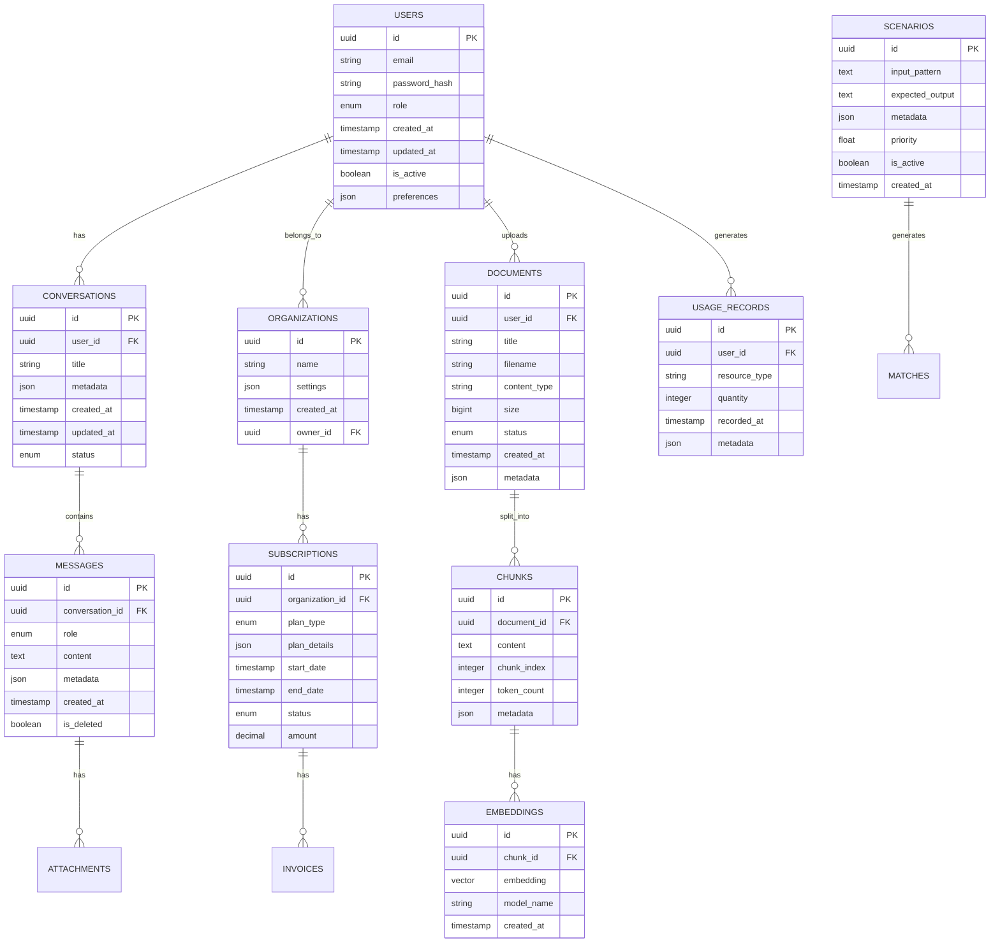

# System Architecture - AI API Platform

## 1. Overview

This document outlines the comprehensive system architecture for the AI API Platform, including microservices design, infrastructure components, data flow, security architecture, and integration patterns.

## 2. High-Level Architecture

### 2.1 System Architecture Overview


### 2.2 Microservices Architecture


## 3. Core Service Architecture

### 3.1 Conversation Service Architecture


### 3.2 AI Orchestration Service Architecture


### 3.3 Knowledge Base Service Architecture


## 4. Data Architecture

### 4.1 Database Design


### 4.2 Caching Strategy


## 5. Security Architecture

### 5.1 Security Layers


### 5.2 Authentication and Authorization Flow


## 6. Deployment Architecture

### 6.1 Kubernetes Deployment


### 6.2 Multi-Region Deployment


## 7. Monitoring and Observability

### 7.1 Observability Stack
```mermaid
graph TB
    subgraph "Application Layer"
        APPS[Applications]
        METRICS_LIB[Metrics Libraries]
        TRACING_LIB[Tracing Libraries]
        LOG_LIB[Logging Libraries]
    end
    
    subgraph "Collection Layer"
        PROMETHEUS[Prometheus]
        JAEGER[Jaeger]
        FLUENTD[Fluentd]
        TELEGRAF[Telegraf]
    end
    
    subgraph "Storage Layer"
        METRIC_STORE[Metric Store]
        TRACE_STORE[Trace Store]
        LOG_STORE[Log Store (ELK)]
        TSDB[Time Series DB]
    end
    
    subgraph "Visualization Layer"
        GRAFANA[Grafana]
        KIBANA[Kibana]
        JAEGER_UI[Jaeger UI]
        CUSTOM_DASH[Custom Dashboards]
    end
    
    subgraph "Alerting Layer"
        ALERTMANAGER[AlertManager]
        PAGERDUTY[PagerDuty]
        SLACK[Slack]
        EMAIL[Email Alerts]
    end
    
    APPS --> METRICS_LIB
    APPS --> TRACING_LIB
    APPS --> LOG_LIB
    
    METRICS_LIB --> PROMETHEUS
    TRACING_LIB --> JAEGER
    LOG_LIB --> FLUENTD
    
    PROMETHEUS --> METRIC_STORE
    JAEGER --> TRACE_STORE
    FLUENTD --> LOG_STORE
    TELEGRAF --> TSDB
    
    METRIC_STORE --> GRAFANA
    TRACE_STORE --> JAEGER_UI
    LOG_STORE --> KIBANA
    METRIC_STORE --> CUSTOM_DASH
    
    PROMETHEUS --> ALERTMANAGER
    ALERTMANAGER --> PAGERDUTY
    ALERTMANAGER --> SLACK
    ALERTMANAGER --> EMAIL
```

### 7.2 Application Performance Monitoring


## 8. Scalability Patterns

### 8.1 Horizontal Scaling Architecture


### 8.2 Performance Optimization Architecture


This comprehensive system architecture documentation provides detailed technical specifications for implementing a robust, scalable, and secure AI API platform that can handle enterprise-scale workloads while maintaining high performance and reliability.
