# User Flows - AI API Platform

## 1. Overview

This document outlines comprehensive user flows for the AI API Platform, covering all user interactions from registration to advanced AI conversations, knowledge base management, and account administration.

## 2. User Registration and Onboarding Flow

### 2.1 New User Registration
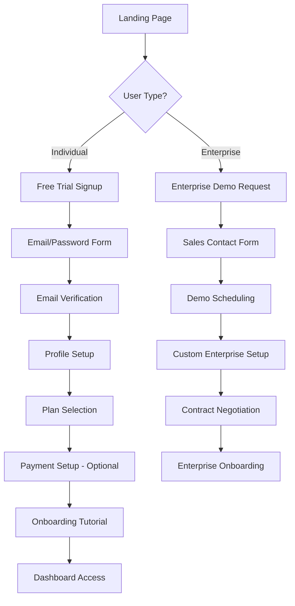

#### Registration Steps:
1. **Landing Page Access**
   - User visits platform website
   - Options: Sign Up, Request Demo, Login
   - Clear value proposition and pricing tiers

2. **Account Creation**
   - Email and password input
   - Password strength validation
   - Terms of service acceptance
   - Optional: OAuth (Google, Microsoft, GitHub)

3. **Email Verification**
   - Verification email sent
   - Email confirmation link click
   - Account activation

4. **Profile Setup**
   - Personal/company information
   - Use case selection
   - Industry vertical
   - Team size estimation

5. **Plan Selection**
   - Free tier automatic activation
   - Paid plan comparison
   - Feature limitations explanation
   - Upgrade path clarification

6. **Onboarding Tutorial**
   - Interactive product tour
   - First conversation setup
   - Knowledge base introduction
   - API key generation

### 2.2 User Login Flow
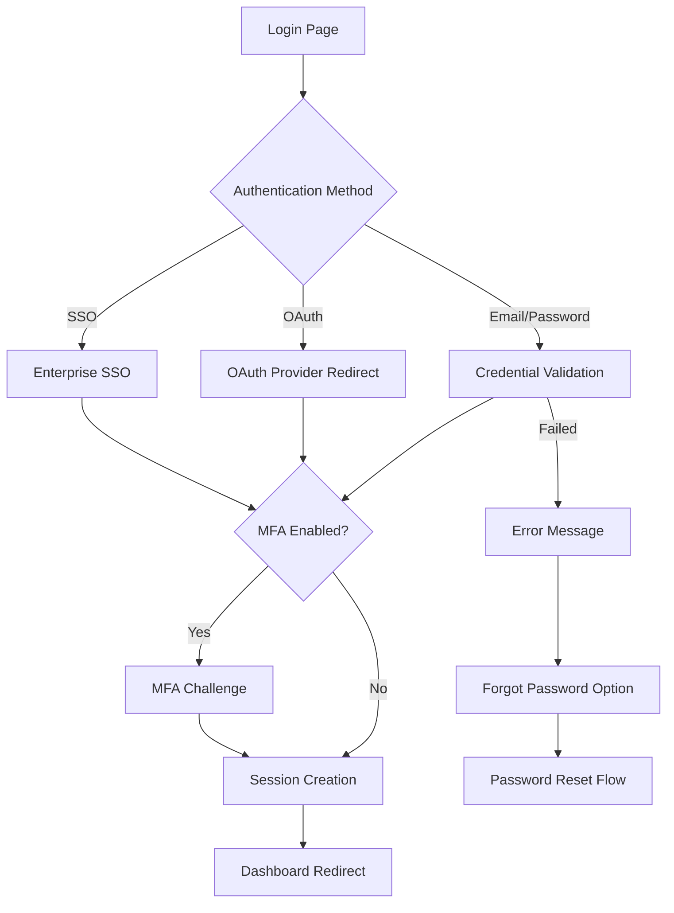

## 3. Core User Interaction Flows

### 3.1 AI Conversation Flow
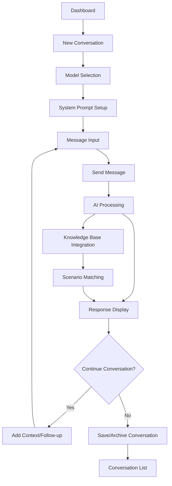

#### Detailed Conversation Steps:

1. **Conversation Initiation**
   - Click "New Conversation" button
   - Select conversation template (optional)
   - Choose AI model/provider
   - Set conversation parameters

2. **Model Configuration**
   - AI provider selection (GPT-4, Claude, Gemini)
   - Temperature and creativity settings
   - Context window configuration
   - Custom system prompts

3. **Message Exchange**
   - Type message in input field
   - Attach files/documents (if supported)
   - Real-time typing indicators
   - Message history display

4. **AI Response Processing**
   - Loading indicators during processing
   - Streaming response display
   - Source attribution for knowledge base content
   - Response quality feedback options

5. **Conversation Management**
   - Save conversation with custom title
   - Share conversation (with permissions)
   - Export conversation (PDF, JSON, TXT)
   - Delete or archive conversation

### 3.2 Knowledge Base Management Flow
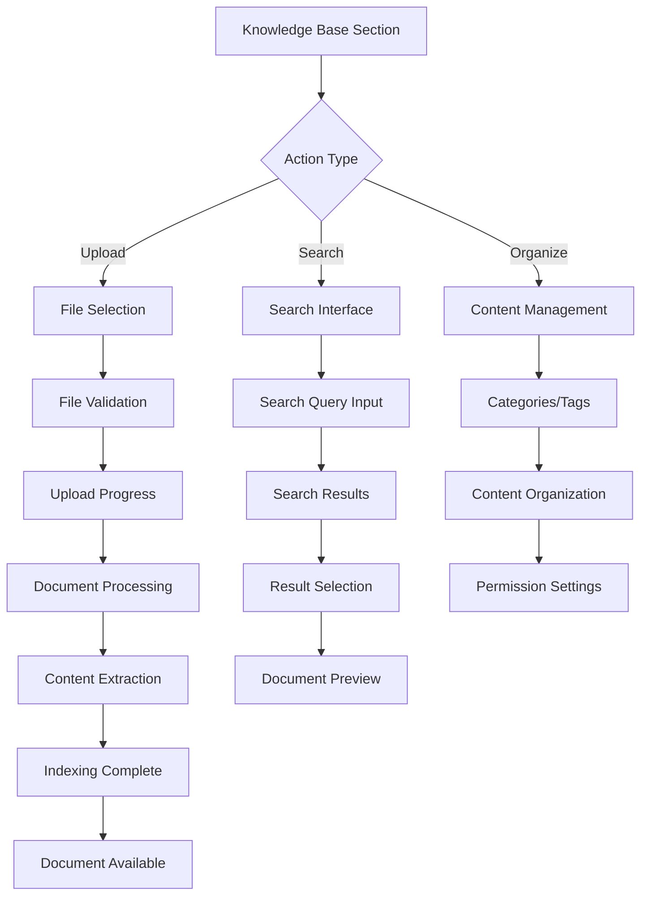

#### Knowledge Base Operations:

1. **Document Upload**
   - Drag-and-drop or file browser
   - Multiple file selection support
   - File type validation (PDF, DOCX, TXT, etc.)
   - Upload progress tracking
   - Processing status updates

2. **Content Search**
   - Semantic search interface
   - Filter options (date, type, tags)
   - Search suggestions and autocomplete
   - Result ranking and relevance scores
   - Quick preview functionality

3. **Content Organization**
   - Folder/category creation
   - Document tagging and labeling
   - Bulk operations (move, delete, tag)
   - Access permission management
   - Content lifecycle management

### 3.3 Scenario Learning Management Flow
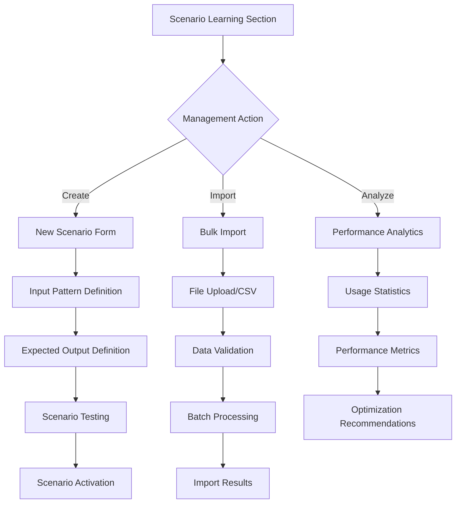

#### Scenario Management Steps:

1. **Scenario Creation**
   - Define input patterns
   - Specify expected outputs
   - Set scenario priority and tags
   - Test scenario matching
   - Activate for production use

2. **Bulk Import**
   - CSV/Excel template download
   - File upload and validation
   - Batch processing with progress tracking
   - Error reporting and correction
   - Bulk activation options

3. **Performance Analysis**
   - Usage frequency metrics
   - Success rate tracking
   - User satisfaction scores
   - A/B testing results
   - Optimization suggestions

## 4. Administrative User Flows

### 4.1 Account Management Flow
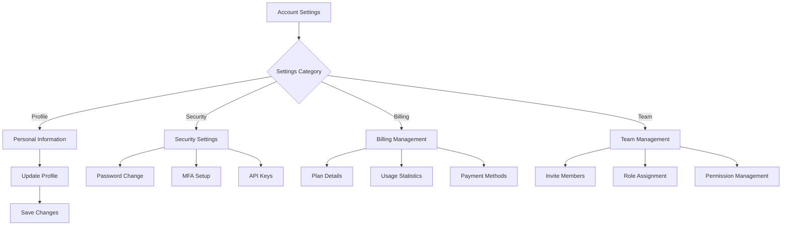

### 4.2 Team Collaboration Flow
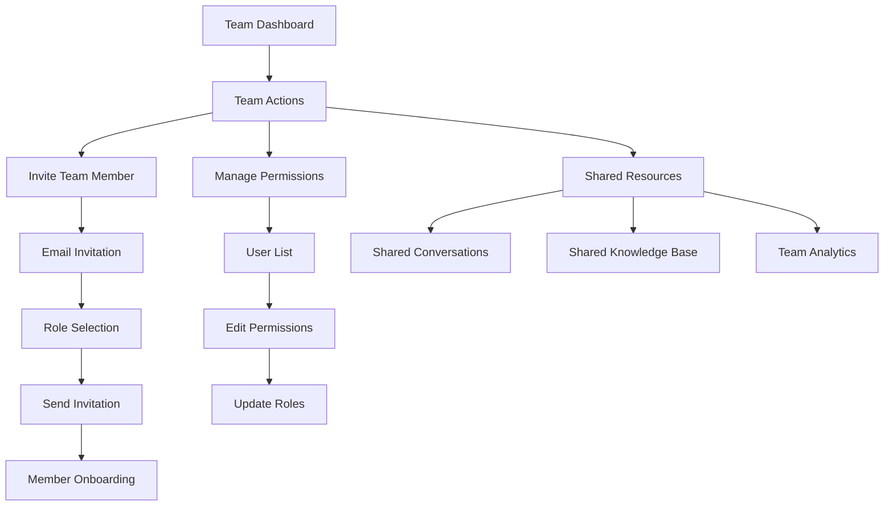

## 5. Advanced User Flows

### 5.1 API Integration Flow
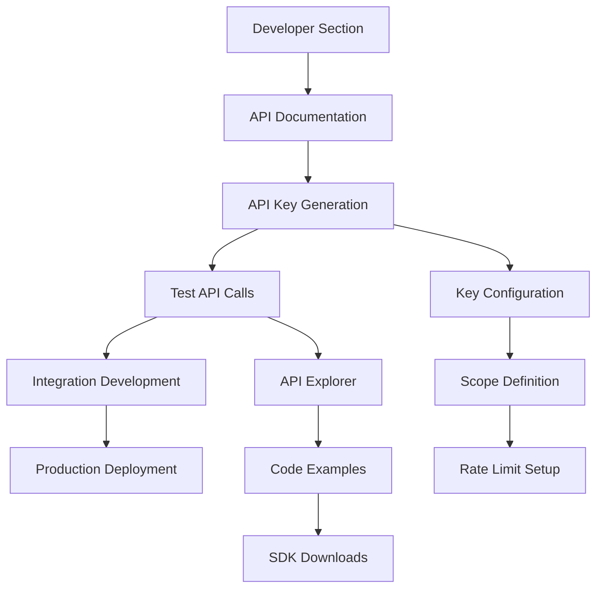

### 5.2 Analytics and Reporting Flow
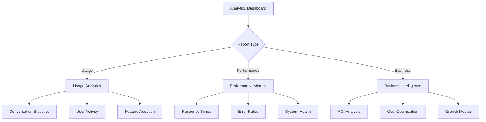

## 6. Mobile and Multi-Device Flows

### 6.1 Mobile Application Flow
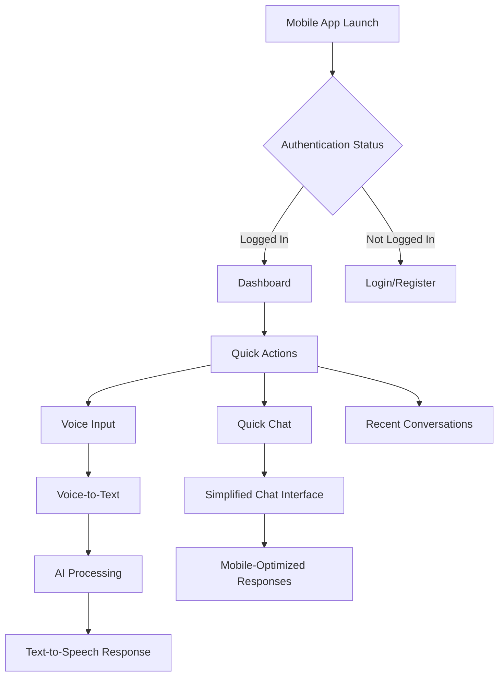

### 6.2 Cross-Device Synchronization Flow
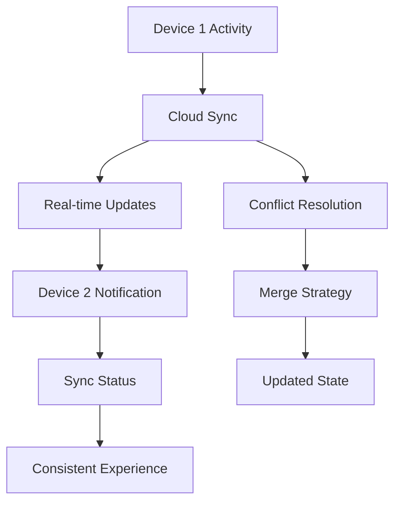

## 7. Error Handling and Edge Cases

### 7.1 Error Recovery Flow
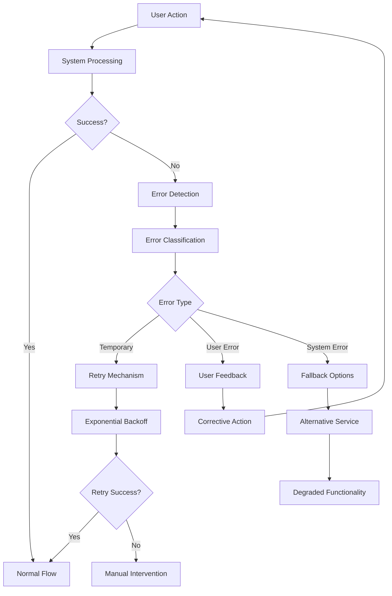

### 7.2 Offline/Network Issues Flow
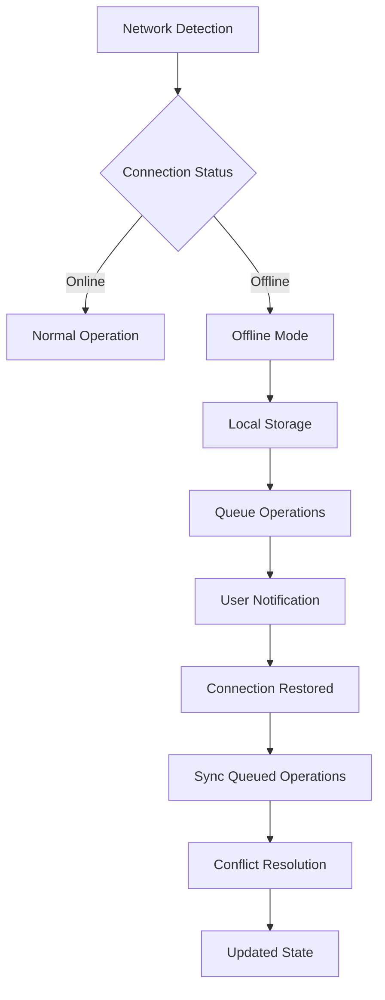

## 8. User Experience Optimization

### 8.1 Progressive Loading Flow
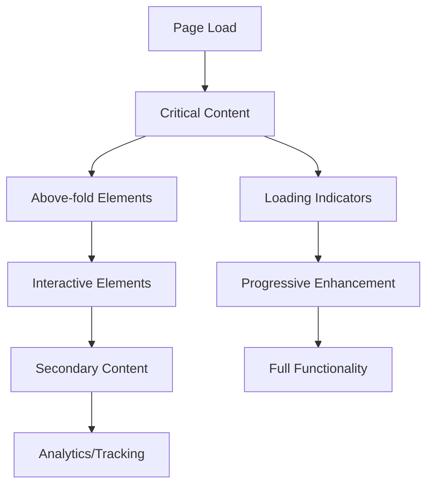

### 8.2 Personalization Flow
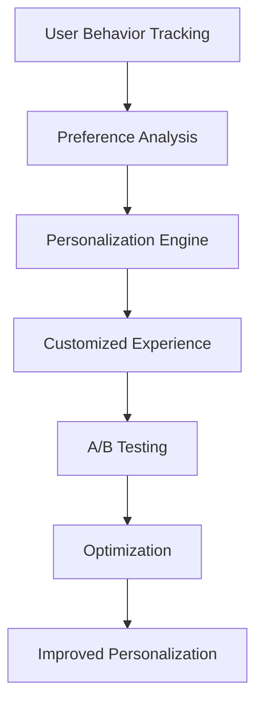

## 9. Accessibility and Inclusive Design

### 9.1 Accessibility Flow
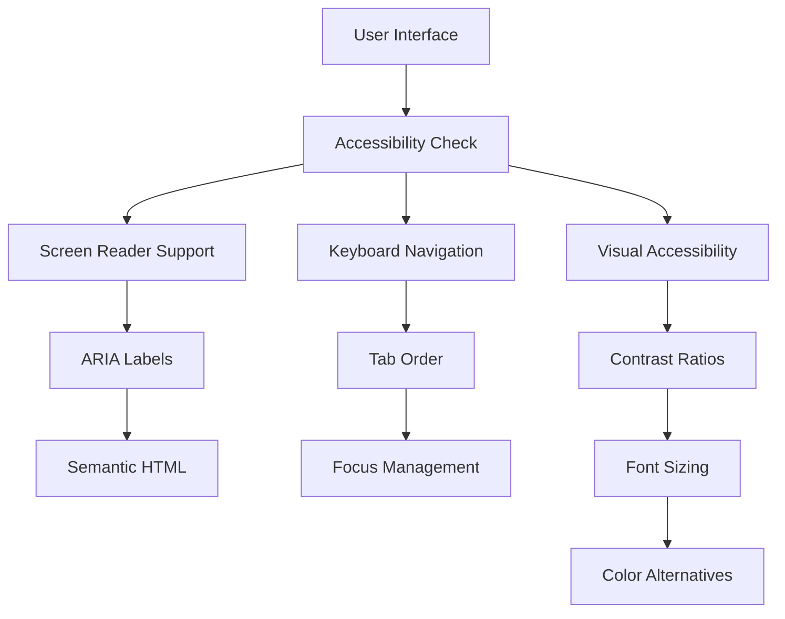

## 10. Security and Privacy Flows

### 10.1 Data Privacy Flow
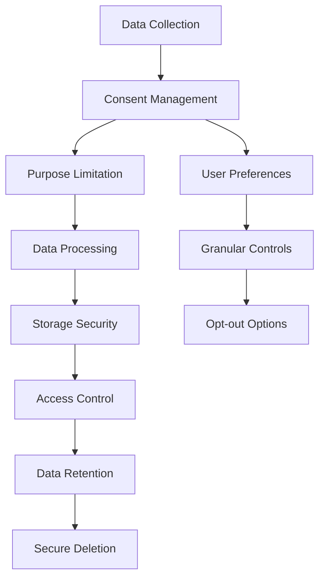

This comprehensive user flow documentation provides detailed pathways for all user interactions within the AI API platform, ensuring a smooth and intuitive user experience across all features and functionalities.
